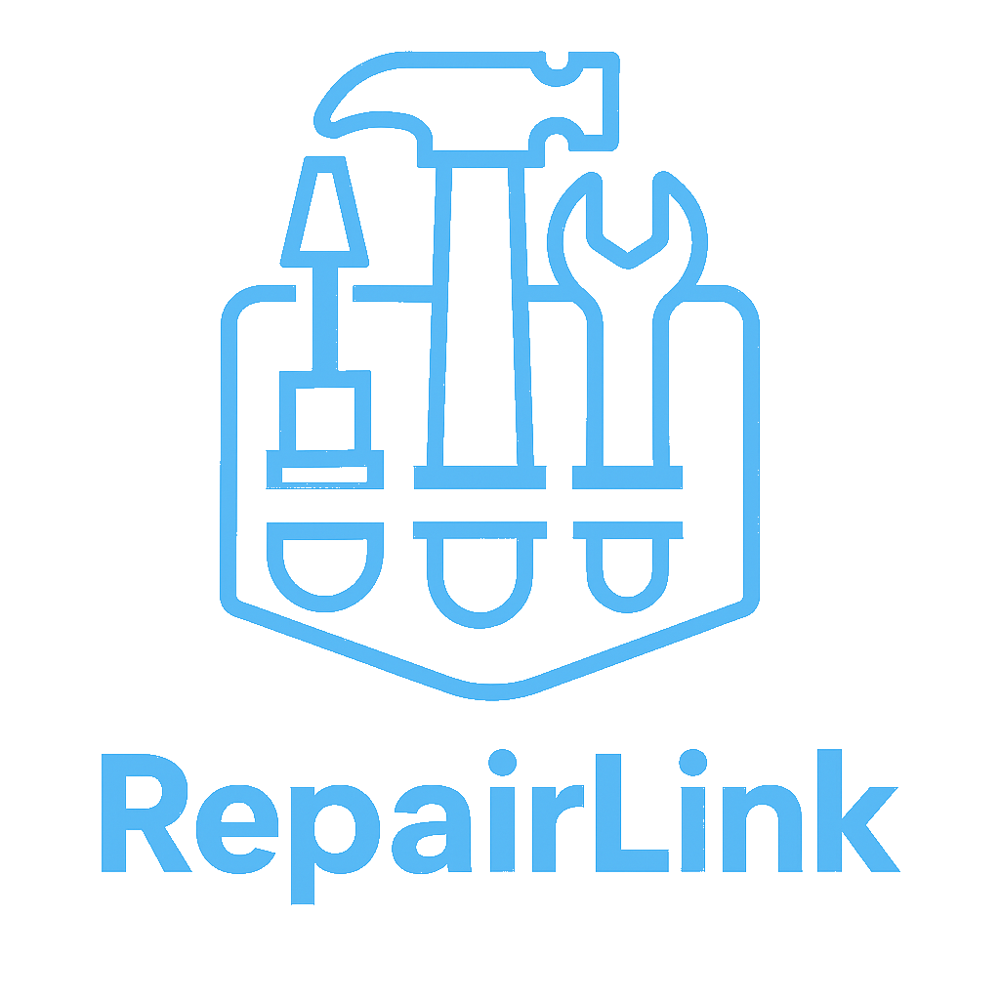

# Capítulo I: Introducción
## 1.1. Startup Profile

Esta sección proporciona una visión integral de la startup, incluyendo una descripción detallada de su misión, visión, y el producto que ofrece. Además, se presentan los perfiles de los miembros clave del equipo, destacando sus habilidades, experiencia y contribuciones al desarrollo y éxito de la empresa. Aquí se busca brindar una comprensión completa de la identidad y el potencial del startup, así como de las personas que impulsan su crecimiento.

### 1.1.1 Descripción de la Startup

*PixelMasters* presenta *RepairLink*, una innovadora plataforma diseñada para conectar a personas con electrodomésticos y dispositivos dañados con técnicos especializados en reparaciones. A través de un ecosistema basado en la sostenibilidad, incentivamos la reparación en lugar de la compra de nuevos productos, promoviendo la economía circular.

**Misión:** Facilitar el acceso a soluciones de reparación confiables, rápidas y ecológicas conectando a personas con técnicos calificados mediante una plataforma inteligente que promueve la sostenibilidad mediante el incentivo de la reparación frente al reemplazo, de esta forma empodera a técnicos con herramientas de visibilidad, formación y gestión, asimismo, ofrece una experiencia segura, transparente y centrada en el usuario.

**Visión:** Ser la plataforma líder en reparación sostenible en Perú, transformando la cultura del consumo a través de la tecnología y fomentando una economía circular donde reparar sea la primera opción frente a desechar. Aspiramos a empoderar a técnicos independientes, reducir el impacto ambiental de los residuos electrónicos y construir una comunidad consciente, conectada y resiliente.

**Logo del Startup:**

**Logo del Producto:**

### 1.1.2 Perfiles de integrantes del equipo

<TABLE BORDER>
	<TR>
		<TH><h2>Intregantes</h2></TH> 
		<TH><h2>Descripción</h2></TH>
		<TH><h2>Conocimientos</h2></TH>
	</TR>
  	<TR>
		<td style="text-align: center" align="center">
 Sebastian Cordova Valdivia - U20   
</td> 
		<td style="text-align: center" align="center"></td>
		<td style="text-align: center" align="center"> </td>
	</TR>
  	<TR>
		<td style="text-align: center" align="center">
 Stanley Jeremy Gutierrez Tume - U202118152   
</td> 
		<td style="text-align: center" align="center"> Soy una persona responsable, perseverante y comprometida con los objetivos que me propongo.Considero que cada experiencia es una oportunidad para crecer, y busco aplicar mis conocimientos en contextos que implican análisis y solución de problemas. A lo largo de la carrera he aprendido a trabajar en equipo lo cuál me ayudó y me ayudará a ser mejor y a su vez aprender más cosas de cada uno de los miembros del equipo. </td>
		<td style="text-align: center" align="center"> A lo largo de mi formación académica, he adquirido competencias en lógica de programación, estructuras de datos y desarrollo orientado a objetos. Estos aprendizajes me han permitido desarrollar un enfoque analítico para la resolución de problemas y una capacidad de adaptación frente a distintos entornos tecnológicos. Asimismo, he participado en diversos proyectos que han fortalecido mis habilidades para el trabajo en equipo y la gestión de tareas.</td>
	</TR>
	<TR>
		<td style="text-align: center" align="center">
 Edson Diego Llamozas Diaz - U20   
</td> 
		<td style="text-align: center" align="center"></td>
		<td style="text-align: center" align="center"> </td>
	</TR>
  	<TR>
		<td style="text-align: center" align="center">
 José Luis Martinez Valdivia - U202213989   
</td> 
		<td style="text-align: center" align="center">Me considero una persona dedicada, constante y con un fuerte sentido de compromiso hacia las metas que me propongo. Veo cada desafío como una oportunidad para aprender y desarrollarme tanto personal como profesionalmente. Me motiva enfrentar situaciones que requieren pensamiento crítico y encontrar soluciones efectivas. Durante mi carrera he fortalecido mi capacidad para colaborar en equipo, lo cual no solo me ha permitido crecer, sino también aprender de las habilidades y perspectivas de los demás.</td>
		<td style="text-align: center" align="center"> Cuento con conocimiento de programacion orientada a objetos, virtualizacion, Angular y AWS. Cuento con buena adaptacion al cambio y a los retos que se me presenten en proyectos.</td>
	</TR>
	<TR>
		<td style="text-align: center" align="center">
 Karen Ramos Carpio - U20201E493  
</td>
		<td style="text-align: center" align="center">Cuento con gran capacidad de autoaprendizaje, esto me permite alcanzar mejores índices de productividad para la empresa de forma individual como en trabajo en 		equipo para poder llegar a los objetivos definidos por la empresa.Tengo un alto sentido del compromiso y la responsabilidad por lo que puedo garantizar que la tarea que me sea asignada será gestionada con 		diligencia.</td>
		<td style="text-align: center" align="center">Desarrollador entusiasta de resolución de problemas de .NET con experiencia en C#, JavaScript, TypeScript, Golang, C++, HTML CSS. Además de .NET, .Net Core, 		Angular, React y Kendo UI.Trabaja bien tanto individualmente como en un ambiente de equipo. Como profesional de TI, me dedico a administrar mis proyectos hasta su finalización, asegurándose de que se 		completen en el plazo establecido</td>
	</TR>
</TABLE>

## 1.2 Solution Profile
### 1.2.1 Antecedentes y problemática
Para identificar el contexto en el que se situa RepairLink, utilizaremos la técnica de las 5 W's y 2 H's.

#### 1.2.1.1. Las 5 W's:

- **What (Qué):** 
RepairLink es una plataforma digital que conecta a personas con dispositivos o electrodomésticos dañados con técnicos independientes calificados. Los usuarios pueden subir fotos y descripciones de sus productos dañados para recibir presupuestos de reparación, comparar opciones y contratar directamente desde la app. La plataforma promueve la reparación como una alternativa sostenible al reemplazo.

- **Why (Por qué):** 
Porque actualmente muchas personas optan por reemplazar sus productos en lugar de repararlos, generando más residuos electrónicos y gasto innecesario. Al mismo tiempo, miles de técnicos independientes tienen poca visibilidad y dificultades para conseguir clientes. RepairLink surge para:
	- Fomentar la economía circular.
	- Reducir el impacto ambiental.
	- Facilitar el acceso a reparaciones confiables y accesibles.
	- Generar oportunidades para técnicos y reparadores locales.

- **Who (Quién):** 
El producto está dirigido a las personas que tienen electrodomésticos dañados y buscan una solución rápida y confiable sin desechar el productoy las personas que se desempeñan como técnicos que son reparadores y técnicos independientes que buscan ampliar su cartera de clientes y profesionalizar sus servicio.

- **Where (Dónde):** 
En zonas urbanas y suburbanas donde hay gran uso de electrodomésticos y falta de acceso a servicios técnicos rápidos, estaria disponible en formato app móvil y plataforma web, accesible desde cualquier dispositivo.

- **When (Cuándo):** 
	- Cuando un producto deja de funcionar y el usuario no sabe si vale la pena repararlo.
	- Cuando un técnico desea mejorar su visibilidad y acceder a más oportunidades laborales.
	- Durante campañas de concientización sobre reciclaje, sostenibilidad y economía circular.
	- En cualquier momento en que se necesite reparar un dispositivo, de manera simple y confiable.

#### 1.2.1.2. Las 2 H's:

- **How (Cómo):** 
El usuario se registra, publica una solicitud de reparación con una breve descripción y fotos del producto.
Técnicos registrados pueden responder con presupuestos y detalles del servicio.
El usuario compara las opciones y agenda la reparación con el técnico que mejor se ajuste a sus necesidades.
El sistema incluye valoraciones, sistema de reputación, opción de garantía post-servicio y recompensas por reparaciones realizadas.
Los técnicos cuentan con una interfaz para gestionar trabajos, historial de clientes y herramientas de comunicación directa.

- **How much (Cuánto):** 
El uso de la plataforma es gratuito, por otro lado solo pagan el servicio contratado, con precios accesibles gracias a la competencia entre técnicos.
Plan gratuito con cobro de comisión por cada trabajo concretado.
Plan premium mensual que ofrece mayor visibilidad, herramientas de gestión, acceso a cursos y participación en campañas promocionales.
Ingresos de la plataforma:
Comisión por servicios realizados.
Suscripciones premium de técnicos.
Espacio para venta de repuestos reutilizados (modelo marketplace).

### 1.2.2 Lean UX Process
#### 1.2.2.1. Lean UX Problem Statements
RepairLink es una plataforma digital enfocada en la conexión entre usuarios con electrodomésticos dañados y técnicos independientes calificados. Su objetivo es brindar una solución eficiente, transparente y sostenible para la reparación de dispositivos, fomentando el cuidado del medio ambiente, el ahorro económico y el empoderamiento de profesionales técnicos.

Hemos identificado que, en el contexto actual, muchas personas enfrentan dificultades a la hora de reparar sus electrodomésticos. La falta de acceso a técnicos confiables, los precios poco claros y la percepción de que “es mejor comprar que reparar” llevan al descarte prematuro de productos que aún podrían tener una larga vida útil. Al mismo tiempo, los técnicos y reparadores independientes encuentran barreras para visibilizar sus servicios y conectar con nuevos clientes de forma profesional y segura.
Esto genera un ciclo problemático: mayor producción de residuos electrónicos, gastos innecesarios para las familias y pérdida de oportunidades laborales para los técnicos. Además, se debilita el concepto de economía circular, clave para un desarrollo más sustentable.

¿Cómo podríamos resolver estos problemas mediante una herramienta digital que conecte de forma ágil, segura y transparente a usuarios y técnicos? La solución debe facilitar el proceso de solicitud de reparaciones, mejorar la confianza en el servicio técnico, promover la reparación como primera opción y ofrecer a los profesionales herramientas que los ayuden a gestionar su trabajo y crecer en el mercado.

RepairLink propone así un entorno donde reparar sea fácil, accesible y socialmente valorado, generando impacto económico, social y ambiental positivo a largo plazo.

#### 1.2.2.2. Lean UX Assumptions

##### 1.2.2.2.1. Assumptions:

Existe una demanda creciente por una solución digital que facilite la reparación de electrodomésticos, debido a los altos costos de reemplazo, la dificultad para encontrar técnicos confiables y la necesidad de alargar la vida útil de los productos.
Las personas están dispuestas a subir información (fotos, descripciones, etc.) de sus aparatos dañados si eso les permite obtener presupuestos rápidos y opciones de reparación accesibles y seguras.
Los técnicos y reparadores independientes están interesados en visibilizar sus servicios en una plataforma que les permita captar clientes, gestionar solicitudes y mejorar su reputación profesional.
Una interfaz simple, transparente y confiable será clave para la adopción tanto por parte de los usuarios como de los técnicos.
Se espera que el modelo de comisión por reparación y suscripción premium para técnicos sea sostenible y atractivo, ya que resuelve problemas reales de conectividad, visibilidad y confianza.
Se asume que la plataforma será técnicamente viable y escalable, pudiendo manejar múltiples solicitudes, fotos, presupuestos y perfiles de técnicos simultáneamente.

##### 1.2.2.2.2. Features:

Permitir a los usuarios subir fotos y descripciones de sus electrodomésticos dañados, generando solicitudes públicas para que técnicos puedan enviar presupuestos.
Ofrecer a los técnicos una sección de oportunidades donde puedan ver las solicitudes según su ubicación, experiencia y disponibilidad.
Incorporar un sistema de reputación basado en calificaciones y comentarios de clientes para aumentar la confianza y profesionalización del servicio.
Facilitar la comunicación directa entre usuarios y técnicos mediante un sistema de chat interno dentro de la plataforma.
Integrar una pasarela de pago segura con opción a pago por adelantado, contraentrega o garantía post-servicio.
Disponer de un área de gestión para técnicos suscritos, que incluya estadísticas de desempeño, agenda de trabajos, y herramientas administrativas básicas.
Brindar soporte técnico y asistencia en caso de conflictos o problemas durante el servicio.

#### 1.2.2.3. Lean UX Hypothesis Statements
- **1st Hypothesis Statement:**  
Nosotros creemos que si implementamos una funcionalidad donde los usuarios puedan subir fácilmente fotos y descripciones de sus productos dañados,
Cuando los usuarios completen su solicitud en la plataforma,
Veremos que se incrementa el número de presupuestos recibidos y la rapidez con la que los técnicos responden,
Mediremos esto a través del tiempo promedio de respuesta, la cantidad de presupuestos generados por solicitud, y la tasa de conversión a reparaciones efectivas.

- **2nd Hypothesis Statement:**  
Nosotros creemos que si desarrollamos un sistema de reputación basado en calificaciones y comentarios después de cada reparación,
Cuando los usuarios dejen su feedback y los técnicos acumulen evaluaciones públicas,
Veremos que la confianza en la plataforma aumentará, generando más contrataciones recurrentes y reduciendo los conflictos por mala calidad del servicio,
Mediremos esto a través de la tasa de repetición de contrataciones, la evolución del promedio de calificaciones, y encuestas de satisfacción general del servicio.

- **3rd Hypothesis Statement:**  
Nosotros creemos que si ofrecemos a los técnicos una sección premium con mayor visibilidad, herramientas administrativas y acceso prioritario a solicitudes,
Cuando los técnicos se suscriban a esta modalidad y gestionen su trabajo desde la plataforma,
Veremos una mejora en su desempeño, fidelización con la plataforma y aumento en sus ingresos mensuales,
Mediremos esto mediante la tasa de conversión a planes pagos, el promedio de servicios contratados por técnico premium y la retención de suscriptores en un periodo de tres meses.

#### 1.2.2.4. Lean UX Canvas

 

## 1.2 Segmento objetivo

La plataforma está diseñada para ofrecer soluciones adaptadas a las necesidades específicas de cada grupo, asegurando una gestión efectiva y personalizada de sus necesidades, identificamos dos segmentos principales:

- **Usuarios con dispositivos dañados** (electrodomésticos, electrónicos, herramientas, etc.).
- **Técnicos y reparadores independientes** que buscan clientes y herramientas avanzadas para su negocio.
