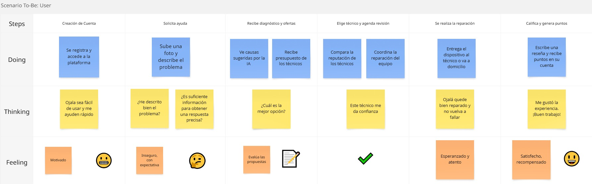
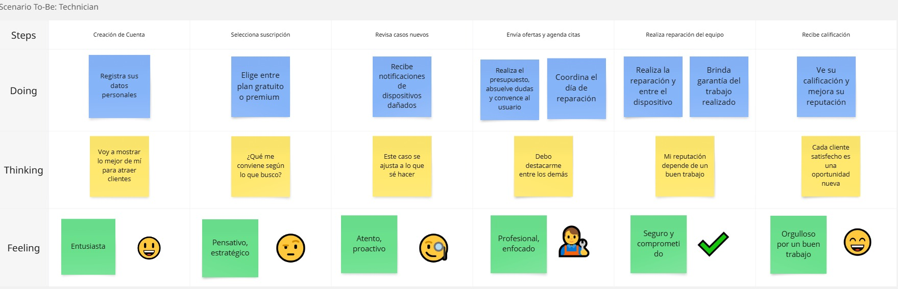
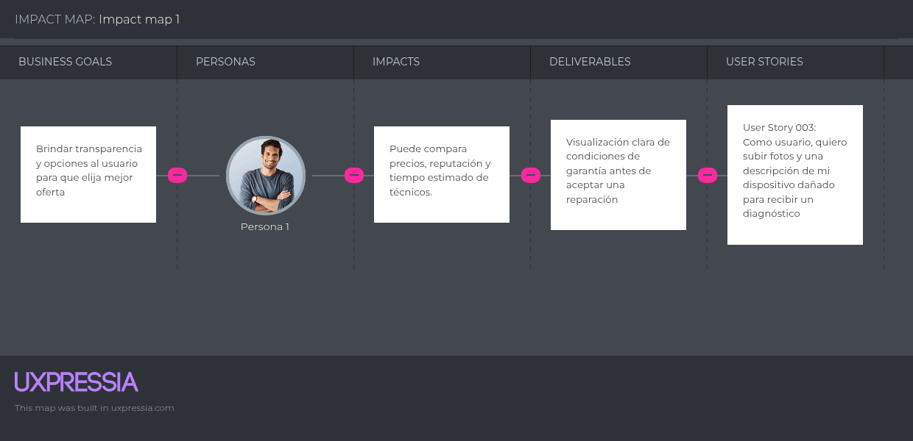
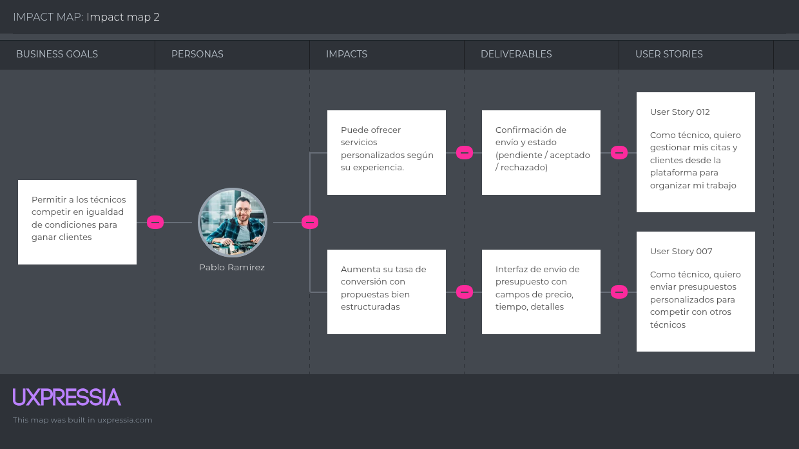

## Capítulo III: Requirements Specification

## 3.1. To-Be Scenario Mapping

 Describiremos cómo funcionará la plataforma en su estado ideal, desde el punto de vista de los principales actores  

Segmento Cliente:

Segmento Técnico:
 

## 3.2. User Stories
| Story ID | Título                   | Descripción                                                                                                                                                                                                                                        | Criterios de Aceptación |
|----------|--------------------------|----------------------------------------------------------------------------------------------------------------------------------------------------------------------------------------------------------------------------------------------------|--------------------------|
| US-001   | Landing Page - Home      | Como visitante, quiero encontrar una página atractiva donde pueda ver una descripción sobre qué ofrece la plataforma desde la sección inicial de la página.                                                                                      | Escenario: Visualización de la descripción Dado que el visitante accede a la landing page Cuando visualiza la sección “Home” Entonces ve una descripción clara con el beneficio principal de la plataforma y un botón de acción ingresar. |
| US-002   | Sección - Reparaciones   | Como visitante, quiero ver los tipos de dispositivos o problemas que se pueden reparar, para saber si me pueden ayudar.                                                                                                                           | Escenario: Explorar tipos de reparaciones Dado que el visitante baja hasta la sección “Reparaciones” Cuando lee la información y ve las imágenes Entonces comprende que dispositivos o fallas están cubiertas por la website. |
| US-003   | Sección - Reseñas        | Como visitante, quiero ver reseñas de otros usuarios para generar confianza en el servicio.                                                                                                                                                       | Escenario: Testimonios y reseñas Dado que el visitante accede a la sección de “Reseñas” Cuando visualiza los testimonios Entonces puede leer los comentarios de otros usuarios con sus calificaciones. |
| US-004   | Sección - Sé un Técnico  | Como visitante interesado, quiero ver una sección que me explique cómo puedo unirme a la website.                                                                                                                                                 | Escenario: Información para técnicos Dado que el visitante accede a la sección de “Sé un técnico” Cuando lee el contenido Entonces entiende los beneficios, pasos a registrarse y encuentra un botón para comenzar. |
| US-005   | Sección - Contacto       | Como visitante, quiero tener un formulario de contacto simple para enviar dudas o comentarios.                                                                                                                                                    | Escenario: Formulario de Contacto Dado que el visitante llega a la sección “Contacto” Cuando completa nombre, email y mensaje Entonces puede enviar el formulario y ver un mensaje de confirmación. |
| US-006   | Registro rápido de usuario | Como usuario cliente, quiero crear una cuenta fácilmente para acceder a los servicios de reparación.                                                                                                                                              | Escenario 1: Registro exitoso con correo electrónico Dado que el usuario accede a la pantalla de registro Cuando completa los campos obligatorios y presiona "Crear cuenta".  Escenario 2: Registro con cuenta de Google o redes sociales Dado que el usuario elige registrarse con Google Cuando autoriza el acceso Entonces el sistema crea la cuenta y lo redirige al panel principal.  Escenario 3: Registro con campos incompletos Dado que el usuario intenta registrarse sin completar los campos requeridos Cuando presiona "Crear cuenta" Entonces el sistema muestra un mensaje de error solicitando completar los campos. |
| US-007   | Registro de técnico      | Como usuario técnico, quiero registrarme y crear un perfil profesional para recibir solicitudes de reparación                                                                                                                                     | Escenario 1: Registro exitoso Dado que el técnico accede al formulario de registro Cuando completa todos los campos y acepta los términos Entonces el sistema crea el perfil y lo pone en revisión  Escenario 2: Activación del perfil Dado que el técnico completó el perfil Cuando el equipo lo verifica Entonces el perfil queda activo y visible para los usuarios |
| US-008   | Subir información del dispositivo | Como usuario cliente, quiero subir fotos y una descripción de mi dispositivo dañado para recibir un diagnóstico                                                                                                                                 | Escenario 1: Envío de fotos y descripción completo Dado que el usuario ya inició sesión Cuando selecciona fotos y escribe una descripción Entonces el sistema confirma el envío exitoso  Escenario 2: Omisión de descripción o fotos Dado que el usuario intenta enviar solo fotos o solo descripción Cuando presiona "Enviar" Entonces el sistema le solicita que complete ambos campos |
| US-009   | Recibir presupuestos     | Como usuario cliente, quiero recibir varios presupuestos de técnicos para comparar diferentes opciones y elegir la mejor                                                                                                                         | Escenario 1: Recepción de múltiples cotizaciones Dado que el usuario ha enviado información del dispositivo Cuando los técnicos responden con propuestas Entonces el sistema le muestra al menos tres cotizaciones  Escenario 2: Comparación de cotizaciones Dado que el usuario recibe varias cotizaciones Cuando accede al detalle de cada una Entonces puede ver precio, tiempo estimado y reputación del técnico |
| US-010   | Ver reputación de técnicos | Como usuario cliente, quiero ver la reputación de los técnicos para tomar una decisión concreta                                                                                                                                                  | Escenario 1: Visualización de calificaciones Dado que el usuario explora técnicos disponibles Cuando abre el perfil de uno Entonces ve su puntuación promedio y comentarios de clientes anteriores |
| US-011   | Chat con técnicos          | Como usuario cliente, quiero poder chatear con los técnicos antes de confirmar una reparación para aclarar dudas                                                  | Escenario 1: Inicio de chat Dado que el usuario recibe cotizaciones Cuando presiona “Chatear” en alguna de ellas Entonces accede a una ventana de conversación con ese técnico  Escenario 2: Recibir respuesta del técnico Dado que el usuario envió una consulta Cuando el técnico responde Entonces el usuario recibe una notificación y puede ver el mensaje |
| US-012   | Agendar Cita               | Como usuario cliente, quiero agendar una cita directamente desde la plataforma para que sea más cómodo                                                             | Escenario 1: Selección de cita Dado que el usuario ha aceptado una cotización Cuando elige día y hora disponibles Entonces el sistema confirma la cita y la agrega a su calendario en la app |
| US-013   | Garantía del servicio      | Como usuario cliente, quiero recibir una garantía del servicio realizado para sentirme más seguro                                                                 | Escenario 1: Visualizar condiciones de garantía Dado que el usuario acepta una reparación Cuando revisa el detalle del servicio Entonces puede ver claramente la duración y condiciones de garantía |
| US-014   | Notificaciones de casos    | Como usuario técnico, quiero recibir notificaciones de nuevos casos en mi especialidad para no perder oportunidades                                                | Escenario 1: Notificación de caso nuevo Dado que un usuario publica un nuevo dispositivo dañado Cuando este coincide con la especialidad del técnico Entonces el técnico recibe una notificación inmediata |
| US-015   | Enviar presupuestos        | Como usuario técnico, quiero enviar presupuestos personalizados para competir con otros técnicos                                                                  | Escenario 1: Envío de presupuesto Dado que el técnico recibe una solicitud Cuando presiona "Enviar presupuesto" y completa los campos Entonces el usuario ve su propuesta junto a las demás |
| US-016   | Gestión de citas y clientes | Como usuario técnico, quiero gestionar mis citas y clientes desde la plataforma para organizar mi trabajo                                                         | Escenario 1: Ver próximas citas Dado que el técnico tiene citas confirmadas Cuando accede a su calendario Entonces puede ver el día, hora y cliente asociado |
| US-017   | Facturación                | Como usuario técnico, quiero acceder a herramientas de facturación para llevar control de mis servicios                                                            | Escenario 1: Generar factura automáticamente Dado que el servicio ha sido finalizado y pagado Cuando el técnico accede a su historial Entonces podrá ver las boletas del servicio |
| US-018   | Calificaciones y comentarios | Como usuario técnico, quiero recibir calificaciones y comentarios para mejorar mi perfil y reputación                                                            | Escenario 1: Visualización de calificaciones Dado que el técnico ha completado varios servicios Cuando accede a su perfil Entonces puede ver un promedio de calificación y leer comentarios de los clientes |
| US-019   | Comunidad de técnicos      | Como usuario técnico, quiero participar en foros con otros reparadores para compartir conocimientos y aprender                                                     | Escenario 1: Participar en un foro Dado que el técnico accede a la sección de comunidad Cuando publica una pregunta o responde a otra Entonces el mensaje aparece disponible para otros técnicos registrados |
| US-020  | Login de usuario           | Como usuario cliente, quiero poder iniciar sesión en la plataforma para acceder a mis dispositivos, cotizaciones y servicios activos. | Escenario 1: Login exitoso Dado que el usuario está en la pantalla de inicio de sesión Cuando ingresa sus credenciales correctas Entonces accede al panel principal del usuario  Escenario 2: Login con datos incorrectos Dado que el usuario ingresa credenciales incorrectas Cuando presiona “Ingresar” Entonces el sistema muestra un mensaje de error indicando datos inválidos  Escenario 3: Recuperación de contraseña Dado que el usuario no recuerda su clave Cuando presiona “¿Olvidaste tu contraseña?” Entonces puede ingresar su correo y recibir un enlace para restablecerla |
| US-021  | Login de técnico           | Como usuario técnico, quiero iniciar sesión en la plataforma para acceder a mis solicitudes, cotizaciones y calendario de citas.          | Escenario 1: Login exitoso Dado que el técnico ingresa sus credenciales correctas Cuando presiona “Ingresar” Entonces accede al panel técnico con su información actualizada  Escenario 2: Perfil en revisión Dado que el técnico se ha registrado pero aún no ha sido aprobado Cuando intenta iniciar sesión Entonces el sistema le indica que su perfil está en revisión                                                                                                       |
| US-022  | Crear perfil profesional técnico | Como técnico registrado, quiero crear un perfil profesional con mis habilidades, especialidades y experiencia, para destacar frente a los clientes. | Escenario 1: Completar perfil técnico Dado que el técnico accede a su perfil Cuando completa su experiencia, especialidades y presentación Entonces el sistema guarda los datos y los muestra en su perfil público  Escenario 2: Perfil incompleto Dado que el técnico no completa los campos obligatorios Cuando intenta guardar Entonces el sistema muestra un mensaje indicando los campos requeridos                                                   |
| US-023  | Carga de documentos de validación | Como técnico registrado, quiero subir documentos como certificaciones o identificaciones, para validar mi identidad y experiencia en la plataforma. | Escenario 1: Subida exitosa de documentos Dado que el técnico está en su perfil Cuando sube archivos válidos (PDF, imágenes) Entonces el sistema guarda los documentos y muestra que están subidos correctamente  Escenario 2: Archivos inválidos Dado que el técnico intenta subir un archivo no permitido Cuando presiona “Subir” Entonces el sistema rechaza el archivo e indica el formato aceptado |
| US-024  | Gestión de perfil del cliente | Como usuario cliente, quiero editar mi información personal y agregar métodos de pago para facilitar futuras transacciones. | Escenario 1: Agregar método de pago Dado que el cliente accede a su perfil Cuando agrega los datos de su método de pago Entonces el sistema guarda la información correctamente  Escenario 2: Edición de información personal Dado que el cliente está en su perfil Cuando actualiza sus datos personales Entonces el sistema guarda los cambios exitosamente |
| US-025  | Vista principal del cliente | Como usuario cliente, quiero ver un panel de inicio con resumen de mis servicios, estado de solicitudes y acceso rápido a funciones principales. | Escenario: Visualización del dashboard Dado que el cliente inicia sesión Cuando accede al panel principal Entonces visualiza sus servicios activos, botones rápidos y actualizaciones recientes |
| US-026  | Panel de servicios del cliente | Como usuario cliente, quiero ver los servicios disponibles, un panel con el historial, servicios en curso y citas agendadas para seguir el estado de mis reparaciones. | Escenario 1: Ver historial de servicios Dado que el cliente accede a la sección “Mis Servicios” Cuando revisa la lista de servicios Entonces puede ver detalles de cada reparación previa  Escenario 2: Ver cronograma de citas Dado que el cliente tiene servicios agendados Cuando abre el cronograma Entonces ve fechas, horas y técnicos asignados |
| US-027  | Solicitar nuevo servicio    | Como usuario cliente, quiero iniciar un nuevo proceso de reparación desde mi panel, seleccionando dispositivo, técnico y cita. | Escenario 1: Solicitud de nuevo servicio Dado que el cliente entra a “Agendar nuevo servicio” Cuando carga información y selecciona técnico Entonces el sistema confirma y agenda la solicitud  Escenario 2: Error por datos incompletos Dado que el cliente omite datos importantes Cuando intenta enviar la solicitud Entonces el sistema indica los campos requeridos |
| US-028  | Notificaciones para cliente | Como usuario cliente, quiero recibir notificaciones sobre mensajes, confirmaciones de citas y cambios de estado en mis servicios. | Escenario 1: Ver notificaciones recientes Dado que el cliente accede a la sección “Notificaciones” Cuando tiene alertas sin leer Entonces puede visualizarlas con fecha y descripción |
| US-029  | Vista del técnico - Dashboard | Como usuario técnico, quiero ver un resumen de mis casos, citas y notificaciones al iniciar sesión. | Escenario 1: Acceso al resumen del día Dado que el técnico accede a su cuenta Cuando entra a su panel principal Entonces ve solicitudes recientes, citas y alertas nuevas |
| US-030  | Ver detalles del perfil técnico | Como usuario técnico, quiero ver cómo luce mi perfil profesional para los clientes, incluyendo mi experiencia, puntuación y documentación. | Escenario 1: Visualización del perfil técnico completo Dado que el técnico accede a su perfil desde el dashboard Cuando revisa su presentación Entonces ve su informacion registra previamente |
| US-031  | Perfil del usuario cliente | Como usuario cliente, quiero acceder a mi perfil para visualizar y actualizar mi información personal, como nombre, correo y teléfono | Escenario 1: Visualizar perfil Dado que el cliente accede a su cuenta Cuando entra a la sección “Mi perfil” Entonces ve su información personal registrada  Escenario 2: Editar perfil Dado que el cliente desea actualizar su información Cuando edita los campos y guarda los cambios Entonces el sistema actualiza los datos correctamente y muestra un mensaje de confirmación |

## 3.3. Impact Mapping

Segmento Cliente:
 

Segmento Técnico:
 

## 3.4. Product Backlog

| ID       | User Story                                                                  | Prioridad | Valor para el Usuario/Negocio      | Sprint |
|----------|-----------------------------------------------------------------------------|-----------|------------------------------------|--------|
| US-006   | Registro rápido de usuario                                                  | Alta      | Acceso básico a plataforma         | 1      |
| US-008   | Subir información del dispositivo                                           | Alta      | Inicia el flujo de diagnóstico     | 1      |
| US-009   | Recibir presupuestos                                                        | Alta      | Permite comparar y elegir técnicos | 2      |
| US-010   | Ver reputación de técnicos                                                  | Media     | Confianza en la elección           | 2      |
| US-011   | Chat con técnicos                                                           | Alta      | Comunicación directa               | 3      |
| US-012   | Agendar cita                                                                | Alta      | Cierre de acuerdo                  | 3      |
| US-013   | Garantía del servicio                                                       | Alta      | Confianza post-reparación          | 4      |
| US-014   | Recompensas por uso                                                         | Media     | Fomenta fidelidad                  | 4      |
| US-007   | Registro de técnico                                                         | Alta      | Permite oferta de servicios        | 1      |
| US-015   | Notificaciones de casos                                                     | Alta      | Mejora tiempos de respuesta        | 2      |
| US-016   | Enviar presupuestos                                                         | Alta      | Competencia y conversión           | 2      |
| US-017   | Gestión de citas y clientes                                                 | Media     | Organización del técnico           | 3      |
| US-018   | Facturación                                                                 | Media     | Control financiero                 | 4      |
| US-019   | Calificaciones y comentarios                                                | Alta      | Reputación y confianza             | 4      |
| US-020   | Comunidad de técnicos                                                       | Baja      | Valor agregado profesional         | 5      |
| US-001   | Landing Page - Home                                                         | Alta      | Primera impresión del usuario      | 1      |
| US-002   | Sección - Reparaciones                                                      | Alta      | Información clara de alcance       | 1      |
| US-003   | Sección - Reseñas                                                           | Media     | Genera confianza inicial           | 1      |
| US-004   | Sección - Sé un Técnico                                                     | Alta      | Convierte visitantes en técnicos   | 1      |
| US-005   | Sección - Contacto                                                          | Media     | Canal de comunicación inicial      | 1      |

