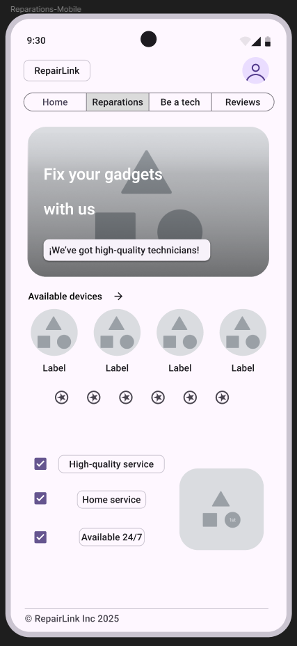
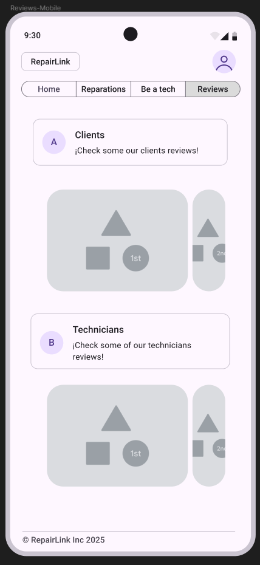
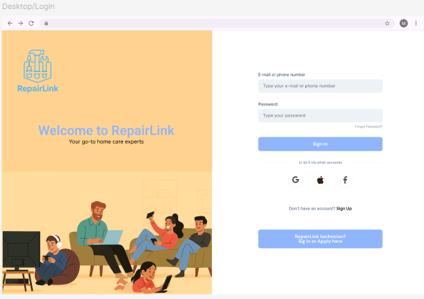
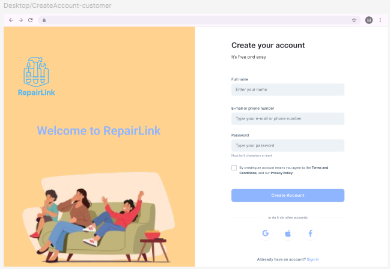
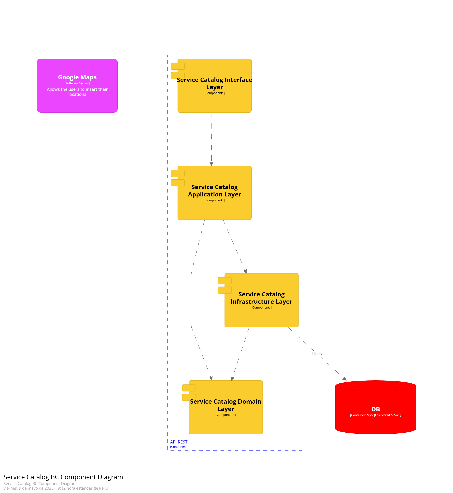

# CAPITULO IV: Product Design
> Gracias al Product Design **adoptamos un enfoque de diseño centrado en el usuario**, lo cual nos permitirá desarrollar productos y servicios funcionales, atractivos y alineados con las expectativas del cliente.
>
> Esta metodología será clave para resolver desafíos específicos, aportar valor tangible a nuestros usuarios y avanzar de forma más efectiva hacia nuestras metas comerciales.

## 4.1.Style Guidelines
> Los **Style Guidelines** es una guia la cual reune las directrices para asegurar un diseño y presentacion coherente de sitios web y software.
> Ahora se presentaran los parametros aplicados para el desarrollo del proyecto
### 4.1.1.General Style Guidelines
> **Branding**  
> Al momento de crear el logo de RepairLink, se decidio por un modelo minimalista el cual refleja nuestro compromiso de optar por reparar los gadgets en lugar de
> desecharlos y contribuir a la contaminacion. Los colores utilizados son suaves, los cuales permiten que el usuario no tenga problema en identificarlo y se mantenga reconocible.
>
> 
>
> **Typography**  
> Para la tipografia de RepairLink, se ha elegido una fuente elegante y funcional que complementa la imagen general de la aplicacion.
> La tipografia principal es Roboto, una fuente que ofrece execelente legibilidad en dipositivos moviles y proporciona un toque moderno y profesional al diseño.
> Para mostrar contraste en los textos, se ha optado por la fuente RobotoSlab, la cual es llamativa. Esto permitira destacar informacion importante y captar la atencion del usuario.
>
>
> Ahora, se mostraran las tipografias respectivas:
> 
>
>   
>
> **Colors**
> La paleta de colores de RepairLink está compuesta por tonos que evocan vitalidad, tranquilidad y motivación, alineados con un estilo de vida activo y equilibrado.
> Los colores seleccionados son brillantes y estimulantes, lo que permite captar la atención del usuario y reflejar la esencia de un producto innovador y lleno de energía.
> A continuación, se detallan los colores elegidos:
>
> 
>
>**Spacing**  
> El espaciado desempeña un papel fundamental en el diseño de RepairLink, ya que permite organizar la información de forma clara y coherente. Se ha aplicado una separación amplia
> entre los elementos de la interfaz para mejorar la legibilidad y facilitar la navegación del usuario. Asimismo, se ha mantenido un espaciado constante en todo el diseño, >lo que aporta equilibrio y armonía a la composición.
>
> 
>
>
### 4.1.2.Web Style Guidelines
> Para el desarrollo de la plataforma web se ha decidido implementar Web Responsive Design, esto permitira que la plataforma se pueda adaptar al dispositivo en el cual se ingrese.
> Gracias a esto el contenido se mantendra intacto, mejorando la presentacion y la experiencia del usuario.
> Se ha optado usar Material Design para la experiencia de usuario ya que este se enfoca en los elementos clave y enfoca la atencion del usuario asia la pagina.
>
> **Icons**  
> Nos aseguraremos de la consistencia y capacidad de lectura de los iconos a las ves que se expresaran las caracteristicas esenciales de esta.
>
> 
>
> **Scale**  
> Se usara un rango de 7 tipo de esquinas en las figuras:
>- None
>- Extra Small
>- Small
>- Medium
>- Large
>- Extra
>- Large
>- Full
>
> 
>
### 4.1.3.Mobile Style Guidelines
> Para el desarrollo de la version mobil se continuara con el uso de Material Design para mantener la uniformidad de platafoma web en diferentes dispositivos.
>
> **Transitions**  
> Se aplicaran transiciones la cuales permitan que la plataforma tenga una sensancion cohesiva y predecible al momento de usarla 
> 
>
## 4.2.Information Architecture
>En este apartado de detallaran el contenido visual y los tagas que se usaran en la elaboracion del Landing Page y la Pagina Web. Se revisaran topicos tales como
>los Labelling Systems, Organization Systems, SEO, Meta Tags y Searaching y Navigation Sytems.
>
### 4.2.1.Organization Systems
> **Home**  
| Topico  | Definicion |
|----------|----------|
| Home | Seccion principal en la cual se mostrara una descripicion del servicios, sus caracteristicas y el proceso de funcionamiento de la plataforma |
| Reparations    | Seccion en la cual se mostrara los tipos de reparaciones la cual la web provee  |
| Be a technician    | Seccion en donde se mostrara los beneficios que se le brinda a un tecnico por unirse a la plataforma   |
| Reviews    | Seccion en la cual se mostraran las opiniones tanto de los tecnicos, como de los usuarios con dispositivos a reparar  |
| Log In    | Seccion por la cual el usaurio se registrara en la plataforma  |

> **Reparations**  
| Topico  | Definicion |
|----------|----------|
| Appliances | Seccion en la cual se mostraran los dispositivos principales disponibles en nuestra plataforma  |
| Locations   | Ciudades y distritos en donde nuestra plataforma esta disponible |
>  **Be a technician**  
> En esta seccion se muestran las caracteristicas de la plataforma para los tecnicosm y la suscripcion opcional
> a la cual pueden acceder.
>
>   **Reviews**  
> Esta seccion mostarara los comentarios dejado por los tecnicos y los clientes respecto a la calidad de plataforma web
>   **Log In**  
| Topico  | Definicion |
|----------|----------|
| Log In | Seccion en la cual se autenticaran las credenciales de un perfil ya existente para acceder a este  |
| Sign Up   | Seccion en la caul se requerira llenar campos con datos personales para poder registrase tanto como Tecnico o Cliente |
>   **Responsive Design**  
>Sera posible tener una experiencia fluida y adaptable para los diferentes dispositivos por los cuales el usuario ingrese a la plataforma
### 4.2.2.Labeling Systems
> Se ha decidido usar etiquetas, estas permitiran organizar en grupos las secciones de la plataforma web. Estas seras accesibles dando click
> a cada etiqueta  
| Topico  | Definicion |
|----------|----------|
| Home | Seccion principal en la cual se mostrara una descripicion del servicios, sus caracteristicas y el proceso de funcionamiento de la plataforma |
| Reparations    | Seccion en la cual se mostrara los tipos de reparaciones la cual la web provee  |
| Be a technician    | Seccion en donde se mostrara los beneficios que se le brinda a un tecnico por unirse a la plataforma   |
| Reviews    | Seccion en la cual se mostraran las opiniones tanto de los tecnicos, como de los usuarios con dispositivos a reparar  |
| Log In    | Seccion por la cual el usaurio se registrara en la plataforma  |
### 4.2.3.SEO Tags and Meta Tags
>Las Meta Tags permiten codificar y detallar los metadatos que una pagina web contiene. Estas son leidas por navegadores y no pueden ser vistos por los usuarios. Gracias
>a estas etiquetas, se facilita la lectura y analisis de archivos HTML.
> **Titulo** 
>Las Meta Tags influyen en el posicionamiento de paginas dentro de los diferentes motores de busqueda existentes.  
>`<title>Repair your gadgets with us REPAIRLINK</title>`  
>**Codificacion de caracteres**  
>Para el desarrollo se uso UFT-8. Esto debido a su eficiencia en termios de memoria para caracteres BMP (Plano Multingue Basico)  
>`<meta charset="utf-8">`  
>**Descripcion** 
>Nos permite brindar una breve despricion de lo que los usuarios pueden encontrar en la pagina web.  
>`<meta name="description" content="RepairLink is a web app that will help you find technicians capable of fixing your gadgets"/>`
>  **Palabras Clave**  
>Etiqueta la cual permite destacar palabras claves realcionadas con el proposito de la pagina web.  
>`<meta name="keywords" content="repair, gadgets, appliances, technicians, save"/>`
>  **Autor y derechos de autor** 
> Registra los dererchos de autor, propiedad y autor de la pagina web.  
>`<meta name="author" content="RepairLink"/>`  
>`<meta name="copyright" content="Copyright RepairLink Team"/>`
### 4.2.4.Searching Systems
> El Searching System es de vital importancia para que los usuarios pueden encontrar los datos que buscan
>  **Caracteristicas Claves**  
>***Busqueda por producto:*** Los usuarios pueden busacr en base a que tipo de producto desean reparar  
> ***Busqueda por marca:*** Los usaurio pueden buscar la marca a la cual su producto a reparar pertenece  
> ***Busqueda por tecnico:*** Los usuarios pueden elegir que tecnino desean que repare su producto  
> ***Filtros Avanzados:*** Los usuarios pueden filtrar los tecnicos de reparacion en base al rating y precio promedio por el cual arreglan productos  
> ***Resultados Destacados:*** El sistema por defecto mostrara a los tecnicos mas solicitados y con mejor rating  
### 4.2.5.Navigation Systems
> El Navigation System permite a los usuarios desplazarase por las diferente secciones de la plaforma de forma fluida.
>  **Estructura de Navegacion:**
> - Home
> - Reparations
> - Be a technician
> - Reviews
> - Log In
## 4.3.Landing Page UI Design
> El diseño aimplementar en la Landing Page sera de suma importancia, ya que este sera el primer vistazo que los usuarios tendran de nuestro producto. Para esto debemos crear una experiencia que captura la atencion de los usuarios de la pagina y los incentive a regresar progresivamente.
### 4.3.1.Landing Page Wireframe
> **Web Version - Home Page**  
> Esta sera la seccion inicial a la cual el usuario sera enviado al momento de ingresar a nuestra plataforma. Aqui se mostrara proceso por el cual nuestro servicio es ofrecido.  
>   
> **Web Version - Reparations**  
>En esta seccion se mostraran los productos a los cuales se le pueden realizar reparacion  
>   
> **Web Version - Be a technician**  
> Seccion en la cual se mostraran los beneficios de unirte a nuestra plataforma como tecnico reparador  
>   
> "Web Version - Reviews"  
> Seccion en la cual se mmostraran las opiniones de nuestros usuarios, tanto clientes como tecnicos  
>   
> **Mobile Web Version - Home Page**  
>Esta sera la seccion inicial a la cual el usuario sera enviado al momento de ingresar a nuestra plataforma. Aqui se mostrara proceso por el cual nuestro servicio es ofrecido.  
>   
> **Mobile Web Version - Reparations**  
>En esta seccion se mostraran los productos a los cuales se le pueden realizar reparacion  
>  
>**Mobile Web Version - Be a technician**  
> Seccion en la cual se mostraran los beneficios de unirte a nuestra plataforma como tecnico reparador  
>   
>**Mobile Web Version - Reviews**  
> Seccion en la cual se mmostraran las opiniones de nuestros usuarios, tanto clientes como tecnicos  
>  
### 4.3.2.Landing Page Mock-up
## 4.4.Web Applications UX/UI Design
### 4.4.1.Web Applications Wireframes
> **Web Version - Login**  
> Esta sera la seccion inicial a la cual el usuario sera enviado al momento de sleccionr el boton de Login o iniciar sesion. Aqui se mostrara proceso por el cual nuestros usuarios inician sesion.  
>   
>   
> **Web Version - Sing up**  
> Esta sera la seccion donde se registran nuestros usuarios  
> Create account for Customers  
>   
> Create account for Technician  
>   
>   
>   
>   
### 4.4.2.Web Applications Wireflow Diagrams
### 4.4.3.Web Applications Mock-ups
> **Web Version - Login**  
>   
>   
> **Web Version - Sing Up**  
>   
>   
>   
>   
>   
### 4.4.4.Web Applications User Flow Diagrams
## 4.5.Web Applications Prototyping
## 4.6.Domain-Driven Software Architecture
> En esta seccion se presentaran los tres niveles del modelo C4 aplicando Domain Driven Design.
### 4.6.1.Software Architecture Context Diagram.
> El diagrama de contexto nos muestra los tipos de usuario que interactuan con el aplicativo web, y a la vez los servicios y/o con los que la plataforma interactua.   
>   
### 4.6.2.Software Architecture Container Diagrams.  
> Este diagram nos permite tener una vision enfocada al desarrollo. Se muestra la forma en la que los usuarios interactuan con la Landing Page, Web App y Mobile App.
> A la vez que se muestra como estas plataformas interactuan con los servicios externos vinculados.  
>   
### 4.6.3.Software Architecture Components Diagrams.  
>En esta seccion se muestra los diagramas de comppnentes de cada uno de los bounded contexts definidos.  
> **APIRest - Component**  
>   
> **Booking - Component**  
>   
> **LocationRouting - Component**  
>   
> **Notification - Component**  
>   
> **Payment - Component**  
>   
> **Review - Component**  
>   
> **Scheduling - Component**  
>   
> **ServiceCatalog - Component**  
>   
> **UserManagement - Component**  
>   
## 4.7.Software Object-Oriented Design.
### 4.7.1.Class Diagrams
> **Booking**  
>   
> **LocationRouting**  
>   
> **Notification**  
>   
> **Payment**  
>   
> **Review**  
>   
> **Scheduling**  
>   
> **ServiceCatalog**  
>   
> **UserManagement**  
>   
> 
### 4.7.2.Class Dictionary
>**User Management Context**

#### `User`
- **Descripción**: Representa a un usuario registrado en la plataforma (cliente, técnico o administrador).
- **Atributos**:
  - `id`: Identificador único (UUID)
  - `name`: Nombre del usuario
  - `email`: Correo electrónico
  - `passwordHash`: Contraseña encriptada
  - `role`: Rol del usuario (`UserRole`)
  - `addressId`: Identificador de dirección

#### `UserRole` (enum)
- **Valores**:
  - `Customer`, `Technician`, `Admin`

#### `UserRepository` (interface)
- Métodos para acceder a los usuarios en la base de datos.

#### `UserService`
- Servicios relacionados al registro y autenticación de usuarios.

###  2. **Booking Context**

#### `Booking`
- **Descripción**: Representa una reserva de servicio con un técnico.
- **Atributos**:
  - `id`: Identificador único
  - `customerId`: ID del cliente
  - `technicianId`: ID del técnico
  - `serviceId`: ID del servicio reservado
  - `scheduledTime`: Fecha y hora de la reserva
  - `status`: Estado de la reserva (`BookingStatus`)
  - `addressId`: Dirección donde se realizará el servicio

#### `BookingStatus` (enum)
- `Requested`, `Confirmed`, `Completed`, `Cancelled`

#### `BookingRepository` (interface)
- Métodos para guardar y buscar reservas.

#### `BookingService`
- Lógica de negocio para crear, cancelar y gestionar reservas.

### 3. **Location & Routing Context**

#### `Address`
- **Descripción**: Representa una dirección geográfica.
- **Atributos**:
  - `id`, `street`, `city`, `zipCode`, `lat`, `lng`

#### `AddressRepository` (interface)
- Acceso a las direcciones.

#### `RoutingService`
- Servicios para calcular distancias y estimar tiempos de llegada.

### 4. **Service Catalog Context**

#### `Service`
- **Descripción**: Un tipo de servicio de reparación ofrecido.
- **Atributos**:
  - `id`, `name`, `description`, `basePrice`

#### `ServiceRepository` (interface)
- Permite listar y obtener servicios.

#### `ServiceCatalog`
- Permite buscar servicios y ver detalles.

###  5. **Payment Context**

#### `Payment`
- **Descripción**: Representa el pago realizado por una reserva.
- **Atributos**:
  - `id`, `bookingId`, `amount`, `paymentMethod`, `status`, `timestamp`

#### `PaymentStatus` (enum)
- `Pending`, `Completed`, `Failed`, `Refunded`

#### `PaymentMethod` (enum)
- `CreditCard`, `PayPal`, `Wallet`

#### `PaymentRepository` (interface)
- Acceso a los datos de pagos.

#### `PaymentService`
- Lógica para procesar pagos.

###  6. **Review Context**

#### `Review`
- **Descripción**: Evaluación de un cliente a un técnico.
- **Atributos**:
  - `id`, `bookingId`, `technicianId`, `customerId`, `rating`, `comments`, `createdAt`

#### `ReviewRepository` (interface)
- Almacena y recupera reseñas.

#### `ReviewService`
- Permite enviar y consultar reseñas.

### 🔷 7. **Notification Context**

#### `Notification`
- **Descripción**: Representa una notificación enviada a un usuario.
- **Atributos**:
  - `id`, `recipientId`, `message`, `type`, `status`, `createdAt`

#### `NotificationType` (enum)
- `Email`, `SMS`, `Push`

#### `NotificationStatus` (enum)
- `Pending`, `Sent`, `Failed`

#### `NotificationService`
- Envía notificaciones y maneja reintentos en caso de error.

### 🔷 8. **Availability Context**

#### `AvailabilitySlot`
- **Descripción**: Rango de tiempo donde un técnico está disponible.
- **Atributos**:
  - `id`, `technicianId`, `startTime`, `endTime`, `isRecurring`, `daysOfWeek`

#### `AvailabilityRepository` (interface)
- Permite guardar y consultar disponibilidades.

#### `AvailabilityService`
- Lógica para gestionar y consultar la disponibilidad de técnicos.

#### `DayOfWeek` (enum)
- `Monday`, `Tuesday`, `Wednesday`, `Thursday`, `Friday`, `Saturday`, `Sunday`

### 🔁 Relaciones entre Contextos (en español)

| Desde → Hacia                     | Tipo de Relación       | Descripción                                                   |
|-----------------------------------|-------------------------|---------------------------------------------------------------|
| `User` → `Address`                | Agregación              | Un usuario tiene una dirección.                              |
| `Booking` → `User`                | Asociación              | La reserva enlaza cliente y técnico mediante sus IDs.         |
| `Booking` → `Address`             | Asociación              | La reserva ocurre en una dirección específica.                |
| `Booking` → `Service`             | Asociación              | Define el servicio reservado.                                 |
| `Booking` → `Payment`             | Uno a uno               | Cada reserva tiene un pago asociado.                          |
| `Review` → `Booking`              | Asociación              | La reseña se vincula a una reserva.                           |
| `Review` → `User`                 | Asociación              | El cliente reseña al técnico.                                 |
| `Notification` → `User`           | Asociación              | Las notificaciones se envían a los usuarios.                  |
| `AvailabilitySlot` → `User`       | Asociación              | La disponibilidad pertenece a un técnico.                     |
| `BookingService` → `AvailabilityService` | Dependencia       | El servicio de reservas consulta disponibilidad antes de crearla. |

## 4.8.Database Design.
### 4.8.1.Database Diagram
> 

