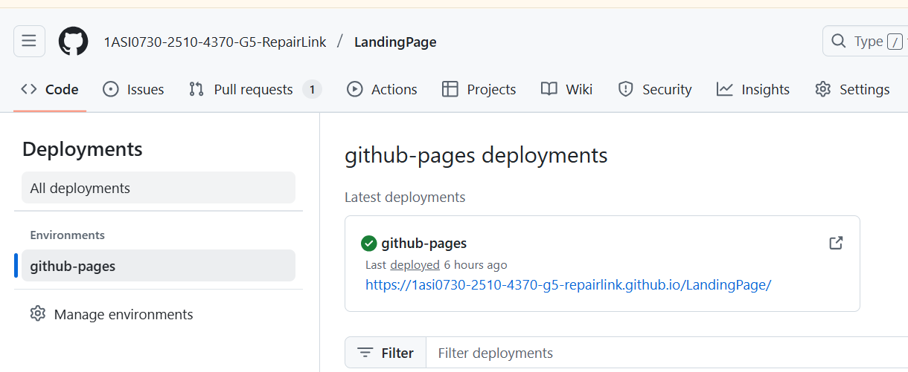

# Capítulo V: Product Implementation, Validation & Deployment

## 5.1. Software Configuration Management

A continuación, se presentará un repositorio central y organizado que servirá como guía para el desarrolloenfocado y consistente de nuestra solución.

### 5.1.1. Software Development Environment Configuration

En esta sección se incluyen los enlaces a las aplicaciones y productos de software desarrollados a lo largo del ciclo del proyecto, utilizando los programas correspondientes. Para ello, se organizará en las siguientes secciones: 

Project Mangement:
 
-Trello es una herramienta visual que facilita la gestión de proyectos y el flujo de trabajo que el equipo de desarrollo seguirá para implementar de manera correcta las tareas de código relacionadas con la Landing Page y la aplicación web.  https://trello.com/es

Product UX/UI Design:

Esta herramienta permite desarrollar el modelo de nuestro producto de manera digital, integrándose así a la experiencia del consumidor. En este caso, se utilizará para crear un modelo de sitio web adaptable tanto para computadoras como para dispositivos móviles.

-Uxpressia: es una herramienta en línea para el mapeo de la trayectoria del cliente, que permite crear mapas de impacto y personas. Sus herramientas nos ayudaron a establecer las bases para el modelado de User Persona, Empathy Map y Journey Map. https://uxpressia.com/

-Miro: es una pizarra digital colaborativa en línea, utilizada para actividades como la investigación, la ideación, la generación de lluvias de ideas, la creación de mapas mentales y diversas otras tareas colaborativas.
https://miro.com/es

-Figma: es una herramienta de prototipado web y editor de gráficos vectoriales que, a diferencia de otras herramientas, se encuentra alojada en la web. Esto permite crear modelos adaptables tanto para la versión en navegador web como para navegador móvil. https://www.figma.com/

Software Development:

Es una estructura utilizada para guiar la creación de un producto de software. Su propósito es definir un proceso que oriente el desarrollo, describiendo distintos enfoques según las actividades que se llevan a cabo a lo largo del ciclo de vida del software.

-Github: Es un repositorio comunitario que nos permite colaborar en proyectos de software, almacenar código, compartirlo y gestionar los cambios a lo largo del tiempo. 

-HTML: es un lenguaje fundamental para quienes desarrollan sitios web. Su función principal es trabajar con hipertextos, permitiendo crear enlaces hacia otros documentos en la red. Además, proporciona las herramientas necesarias para diseñar la estructura y el contenido visual de una página web.

-CSS: es un lenguaje de diseño gráfico que se utiliza para definir y controlar la presentación visual de un documento escrito en un lenguaje de marcado como HTML o XML.

### 5.1.2. Source Code Management

A continuación, se describe la administración del código fuente. Su objetivo principal es llevar un registro de todos los cambios que el equipo realice en los archivos de código de sus proyectos, dentro de los repositorios designados. Se utilizará como un sistema de control de versiones, lo que permitirá rastrear las modificaciones que cada miembro  implemente en el proyecto. Es importante destacar que para este sistema de control de versiones se empleará GitHub. 

Repositorio : https://github.com/1ASI0730-2510-4370-G5-RepairLink

Web Services Repository: https://1asi0730-2510-4370-g5-repairlink.github.io/LandingPage/

ESQUEMA DE CONTROL DE VERSIONES:

-Rama principal (main): Contendrá siempre la versión estable de la aplicación.

-Rama de desarrollo (develop): Servirá como rama integradora para el desarrollo de nuevas características y cambios no verificados.

-Ramas de características (feature branches): Cada nueva funcionalidad se desarrollará en una rama propia, siguiendo la convención de nombres como feature/<nombre-de-la-caracteristica>.

-Ramas de corrección de errores (hotfix branches): En caso de problemas críticos en producción, se utilizarán ramas de corrección rápida, denominadas hotfix/<descripcion-del-arreglo>.

-Ramas de liberación (release branches): Para preparar las versiones estables y nuevas funcionalidades, se creará una rama release/<version> para realizar pruebas y ajustes finales antes de la liberación.

GITFLOW Y CONVENCIONES DE COMMITS:

El equipo implementará el flujo de trabajo GitFlow como modelo para el control de versiones. Además, se utilizarán las convenciones Conventional Commits para los mensajes de commit, siguiendo las siguientes directrices:

-feat: para nuevas características.

-fix: para correcciones de errores.

-docs: para cambios en la documentación.

-style: para modificaciones en la apariencia del código sin cambios de funcionalidad.

-refactor: para mejoras del código que no afectan su funcionalidad.

### 5.1.3. Source Code Style Guide & Conventions

Para mantener nuestro código limpio, uniforme , en este proyecto utilizaremos la Guía de Estilo de Google para HTML/CSS. Esta guía nos ayudará a escribir código HTML y CSS de manera clara y organizada. Algunas de las reglas que seguiremos son:

-Usaremos solo dos espacios para la indentación, tanto en HTML como en CSS. Esto hace que el código sea fácil de leer sin que ocupe demasiado espacio horizontal.

-Ordenaremos los selectores de CSS de forma lógica: primero los selectores de elementos (tipo), luego los de ID y al final los de clase.

-Elegiremos nombres de clase cortos pero que expliquen bien su función, usando guiones bajos para separar las palabras y facilitar la lectura.

-Añadiremos comentarios solo cuando sea necesario aclarar reglas de CSS que no sean obvias a primera vista.

Esta sección describe el estilo y las convenciones del código fuente que se observan en este proyecto web para garantizar la coherencia y la mantenibilidad.

## 1. Convenciones de HTML:

* **Indentación:** El código HTML utiliza una indentación de **cuatro espacios** para los elementos anidados, lo que mejora la legibilidad y la estructura.
* **HTML Semántico:** El código emplea elementos HTML5 semánticos como `<header>`, `<nav>`, `<main>`, `<section>` y `<footer>` para definir claramente la estructura y el propósito de las diferentes partes de la página web.
* **Nomenclatura de Clases:** Los nombres de las clases CSS son generalmente descriptivos y utilizan minúsculas con guiones para separar las palabras (por ejemplo, `hero-box`, `segmented-container`, `language-switcher`).
* **Image Handling:** Las etiquetas `` incluyen el atributo `alt` para proporcionar texto alternativo para la accesibilidad y en caso de que la imagen no se pueda cargar.
* **Navegación:** El elemento `<nav>` se utiliza para la navegación principal, y se emplean atributos `aria-label` para mejorar la accesibilidad. Los botones dentro de la navegación también utilizan `aria-label` para una mejor compatibilidad con lectores de pantalla.

## 2. Convenciones de CSS:

* **Nomenclatura de Selectores:** Los selectores de CSS utilizan principalmente nombres de clase descriptivos en minúsculas, separando palabras con guiones (kebab-case), lo que coincide con las clases utilizadas en el HTML.

* **Organización:** El CSS está organizado en secciones lógicas, con comentarios que indican el propósito de cada sección (por ejemplo, `/*MIDDLE-REVIEWS*/`, `/*REPARATIONS*/`, `/*GOOFY AHH CONTAINER*/`, `/* Header Right Container */`, `/* Language Switcher Styles (updated) */`, `/* Logo-Account */`).

* **Indentación:** Las reglas de estilo dentro de cada selector están indentadas con **cuatro espacios** para mejorar la legibilidad.

* **Propiedades y Valores:** Las propiedades CSS se escriben en minúsculas, y los valores utilizan las convenciones estándar (por ejemplo, valores hexadecimales en minúsculas `#fcead2`, unidades como `px`, `%`, `em`).

* **Uso de `font-family`:** Se definen claramente las fuentes utilizando la propiedad `font-family`, incluyendo una fuente principal y una fuente de respaldo (`'Roboto', sans-serif` y `'Roboto Slab', serif`).

* **Modelo de Caja:** Se utilizan propiedades como `margin`, `padding`, `border`, `width`, `height` y `box-shadow` para definir el diseño y la apariencia de los elementos.

* **Flexbox:** Se utiliza ampliamente Flexbox (`display: flex`, `flex-direction`, `align-items`, `justify-content`, `flex-wrap`, `gap`) para la disposición y el alineamiento de los elementos, tanto en el encabezado, la navegación, las secciones principales y el pie de página.

* **Posicionamiento:** Se utiliza `position: fixed` para el encabezado y el pie de página, y `position: absolute` para elementos dentro de ellos.

* **Z-index:** Se utiliza `z-index` para controlar el orden de apilamiento de elementos posicionados (`header`, `footer`).

* **Pseudo-elementos:** Se utilizan pseudo-elementos (`::after`, `::before`) para añadir elementos visuales (líneas divisorias) sin necesidad de HTML adicional.

* **Media Queries:** Se incluye una media query (`@media (max-width: 768px)`) para aplicar estilos específicos en pantallas más pequeñas, lo que indica un enfoque en el diseño responsivo.

* **Transiciones:** Se utiliza la propiedad `transition` para crear efectos visuales suaves al interactuar con los elementos (por ejemplo, en los botones de navegación y los botones de idioma).

* **Colores:** Se utilizan valores hexadecimales y `rgb()` para definir los colores de fondo, texto y bordes.

### 5.1.4. Software Deployment Configuration

En esta sección se detalla el proceso de despliegue de los productos digitales desarrollados para la solución. A partir de los repositorios de código fuente en GitHub, el despliegue de cada componente se realizará de la siguiente manera:

### Landing Page Deployment:
HTML: sirve de referencia del software que interactúa con la elaboración de páginas web en sus diferentes versiones.

Evidencia: Archivos HTML, el principal es index.html donde todos los integrantes juntaron el contenidorealizado en su rama individual.
 

Css: Es aquel que nos ayudó con el diseño gráfico para que el Landing Page sea agradable e interactiva.

Evidencia: Se presenta el file styles.css, donde el grupo implemento el diseño de toda la estructura realizada con html.

Todo el despliegue fue gracias a las siguientes herramientas:

-GitHub: Plataforma de desarrollo colaborativo.

-Git Flow: Nos permitió controlar el avance de cada uno de nuestros integrantes con respecto aldesarrollo del Landing Page.

-Git Hub Pages: Servicio de Github que nos permitió alojar nuestra Landing page.

Evidencia de deployment: 

Enlace para acceder a la landing page: https://1asi0730-2510-4370-g5-repairlink.github.io/LandingPage/

### Front End Web Application deployment

Para poder desplegar el Front End Web Application resulta necesario contar con una serie de requisitos, entre ellos, es necesario contar con una cuenta personal, una organización y un repositorio al cual cargar los documentos. A partir de lo anterior, es posible comenzar el despliegue de la landing page. A continuación se enuncian los pasos a seguir:

Enlace para acceder al Frontend: https://repairlink.netlify.app/

 

## 5.2. Landing Page, Services & Applications Implementation
### 5.2.1. Sprint 1
#### 5.2.1.1. Sprint Planning 1

### SPRINT PLANNING BACKGROUND
Fecha: 06/04/2025
Hora: 8:00 p.m.
Ubicación: Virtual, vía Google Meet
Preparado por: Karen Stephanie Ramos Carpio
Asistentes:
Sebastian Córdova Valdivia, Stanley Jeremy Gutiérrez Tume, Edson Diego Llamozas Díaz, José Luis Martínez Valdivia, Karen Stephanie Ramos Carpio.
Sprint 1 – Review Summary:
Durante la primera reunión del Sprint, el equipo se enfocó en definir las tareas y responsabilidades de cada miembro, asegurando que todos estuvieran alineados con los objetivos del informe a desarrollar. Se acordó que cualquier duda sobre el desarrollo sería comunicada por el chat grupal de WhatsApp.
Sprint 1 – Retrospective Summary:
En esta retrospectiva, el equipo discutió cómo se llevó a cabo la planificación del Sprint y la distribución de tareas. Todos los participantes cumplieron con sus entregables, y se corrigieron algunos puntos que se consideró podían ser mejorados para optimizar la calidad del trabajo final.
Sprint Goal & User Stories
Sprint 1 Goal: Diseñar e implementar la Landing Page, con el objetivo de comunicar claramente nuestra propuesta de valor.
Sprint 1 Velocity: 12
Total de Story Points: 12

#### 5.2.1.2. Sprint Backlog 1
En esta sección se muestran los tasks que se realizaron en el presente sprint:

| Story ID | Título                        | Descripción breve                                              | Estimación (Story Points) | Estado      | Responsable                         |
|----------|-------------------------------|-----------------------------------------------------------------|----------------------------|-------------|-------------------------------------|
| US-001   | Landing Page - Home           | Página inicial con descripción y botón de acción.              | 3                          | Completado  | Karen Ramos                         |
| US-002   | Sección - About Us       | Información visual sobre el equipo de RepairLink.    | 2                          | Completado  | Sebastián Córdova                   |
| US-003   | Sección - Our Services            | Información visual sobre los servicios que ofrece RepairLink| 2                          | Completado  | Stanley Gutiérrez                   |
| US-004   | Sección - Contact Us    | Informacion de Contacto                | 2                          | Completado  | Edson Llamozas                      |
| US-005   | Sección - Reviews            | Mostrar testimonios y calificaciones de clientes.               | 3                          | Completado  | José Luis Martínez                  |

**Sprint Goal:** Diseñar e implementar el Landing Page con el objetivo de concretar nuestra propuesta de valor.  
**Sprint Velocity:** 12 puntos  
**Fecha del Sprint:** 06-04-2025  

#### 5.2.1.3. Development Evidence for Sprint Review

| Repository       | Branch         | Commit Id | Commit Message                          | Commit Message Body                             | Committed on (Date) |
|------------------|----------------|-----------|------------------------------------------|--------------------------------------------------|---------------------|
| https://github.com/1ASI0730-2510-4370-G5-RepairLink/LandingPage| LandingPage| 7a15871| feat: add images for logo and illustrations| feat: add images for logo and illustrations| 22/04/2025|
|                   | LandingPage| 8664d3f| feat: update be-a-tech.html| feat: update be-a-tech.html| 22/04/2025|
|                   | LandingPage| a108a01| feat: update style.css| feat: update style.css| 22/04/2025|
|                   | LandingPage| 5d4dc04| fix(be-a-tech): correct image paths for all images| fix(be-a-tech): correct image paths for all images| 22/04/2025|
|                   | LandingPage| 1745ad6| feat(reparations): add reparations section| feat(reparations): add reparations section| 22/04/2025|
|                   | LandingPage| 351eb3c| feat(reviews): completed the Reviews section| feat(reviews): completed the Reviews section| 21/04/2025|
|                   | LandingPage| af10600| feat(reviews): added aria labels| feat(reviews): added aria labels| 21/04/2025|

#### 5.2.1.4. Execution Evidence for Sprint Review

Durante este Sprint, se completó la implementación del diseño y la estructura básica de la Landing Page para el proyecto RepairLink, utilizando los avances de diseño de Figma. A continuación, se presentan las vistas clave de la Landing Page.

#### 5.2.1.5. Services Documentation Evidence for Sprint Review

 Para este primer sprint no fue contemplada la evidencia de documentación de los servicios

#### 5.2.1.6. Software Deployment Evidence for Sprint Review

Durante el Sprint 1, el equipo no realizó despliegues en ambientes de prueba o producción. Sin embargo, se avanzó en la planificación del proceso de deployment para los productos involucrados: Landing Page, Web Applications y Web Services.

El enfoque de este Sprint se centró en establecer la base técnica para permitir un deployment ágil en próximos sprints. Se definieron herramientas y proveedores potenciales, así como una estructura de proyecto que facilitará futuras automatizaciones e integraciones.

Acciones realizadas durante el Sprint 1

Actividad	Descripción

-Configuración de repositorios	Se estructuró el repositorio principal en GitHub para facilitar integración y control de versiones de los productos: Landing Page, Web App y Web Services.

-Evaluación de servicios cloud	Se evaluaron opciones como GitHub Pages (para Frontend), Render y Railway (para Backend) para realizar despliegues en los próximos sprints.

-Estructura de carpetas para CI/CD	Se organizaron las carpetas del repositorio con vistas a una futura integración con GitHub Actions para automatizar el proceso de deployment.

-Validación local	La Landing Page fue ejecutada y validada en entorno local como preparación para su futura publicación.

#### 5.2.1.7. Team Collaboration Insights during Sprint

Durante el Sprint 1, el equipo trabajó de manera colaborativa enfocándose principalmente en el diseño y la implementación inicial de la Landing Page. Se distribuyeron tareas según los perfiles técnicos y se empleó GitHub como principal herramienta para el control de versiones, seguimiento de commits y colaboración en el desarrollo.

Cada miembro del equipo contribuyó activamente con tareas específicas relacionadas con el desarrollo, la revisión de código, la estructuración de carpetas y la organización del repositorio. Además, se mantuvo una comunicación fluida mediante reuniones de planificación y seguimiento, apoyadas por Google Meet.

### 5.2.2. Sprint 2
#### 5.2.2.1. Sprint Planning 2
<table style="border-collapse: collapse; width: 100%;">
  <tbody>
    <tr>
      <td style="border:1pt solid #000000;padding:5pt;vertical-align:top;"><strong>Sprint #</strong></td>
      <td style="border:1pt solid #000000;padding:5pt;vertical-align:top;"><strong>Sprint 2</strong></td>
    </tr>
    <tr>
      <td style="border:1pt solid #000000;padding:5pt;vertical-align:top;" colspan="2"><strong>Sprint Planning Background</strong></td>
    </tr>
    <tr>
      <td style="border:1pt solid #000000;padding:5pt;vertical-align:top;">Date</td>
      <td style="border:1pt solid #000000;padding:5pt;vertical-align:top;">01-05-2025</td>
    </tr>
    <tr>
      <td style="border:1pt solid #000000;padding:5pt;vertical-align:top;">Time</td>
      <td style="border:1pt solid #000000;padding:5pt;vertical-align:top;">7:00 pm</td>
    </tr>
    <tr>
      <td style="border:1pt solid #000000;padding:5pt;vertical-align:top;">Location</td>
      <td style="border:1pt solid #000000;padding:5pt;vertical-align:top;">Via virtual por Google Meet</td>
    </tr>
    <tr>
      <td style="border:1pt solid #000000;padding:5pt;vertical-align:top;">Prepared By</td>
      <td style="border:1pt solid #000000;padding:5pt;vertical-align:top;">Karen Stephanie Ramos Carpio</td>
    </tr>
    <tr>
      <td style="border:1pt solid #000000;padding:5pt;vertical-align:top;">Attendees</td>
      <td style="border:1pt solid #000000;padding:5pt;vertical-align:top;">Sebastián Cordova Valdivia, Stanley Jeremy Gutierrez Tume, Edson Diego Llamozas Diaz, José Luis Martinez Valdivia, Karen Stephanie Ramos Carpio</td>
    </tr>
    <tr>
      <td style="border:1pt solid #000000;padding:5pt;vertical-align:top;" colspan="2"><strong>Sprint 2 - Review Summary</strong></td>
    </tr>
    <tr>
      <td style="border:1pt solid #000000;padding:5pt;vertical-align:top;" colspan="2">Durante la primera reunión del Sprint, el equipo se enfocó en definir las tareas y responsabilidades de cada miembro, asegurando que todos estuvieran alineados con los objetivos del informe a desarrollar y cualquier duda acerca del desarrollo hacernoslo saber por nuestro chat de whatsapp.</td>
    </tr>
    <tr>
      <td style="border:1pt solid #000000;padding:5pt;vertical-align:top;" colspan="2"><strong>Sprint 2 - Retrospective Summary</strong></td>
    </tr>
    <tr>
      <td style="border:1pt solid #000000;padding:5pt;vertical-align:top;" colspan="2">En esta retrospectiva, el equipo discutió cómo se llevó a cabo la planificación del Sprint y la distribución de tareas. Todos los participantes lograron hacer su parte del trabajo, ya que corregimos algunos puntos que nos parecían que se podían mejorar.</td>
    </tr>
    <tr>
      <td style="border:1pt solid #000000;padding:5pt;vertical-align:top;" colspan="2"><strong>Sprint Goal & User Stories</strong></td>
    </tr>
    <tr>
      <td style="border:1pt solid #000000;padding:5pt;vertical-align:top;">Sprint 2 goal</td>
      <td style="border:1pt solid #000000;padding:5pt;vertical-align:top;">Diseñar e implementar el FrontEnd del Aplicativo Web</td>
    </tr>
    <tr>
      <td style="border:1pt solid #000000;padding:5pt;vertical-align:top;">Sprint 1 Velocity</td>
      <td style="border:1pt solid #000000;padding:5pt;vertical-align:top;"><strong>12</strong></td>
    </tr>
    <tr>
      <td style="border:1pt solid #000000;padding:5pt;vertical-align:top;">Sum of Story Points</td>
      <td style="border:1pt solid #000000;padding:5pt;vertical-align:top;"><strong>31</strong></td>
    </tr>
  </tbody>
</table>
                           
#### 5.2.2.2. Sprint Backlog 2

En esta sección se muestran los tasks que se realizaron en el presente sprint:

| Story ID | Título                        | Descripción breve                                              | Estimación (Story Points) | Estado      | Responsable                         |
|----------|-------------------------------|-----------------------------------------------------------------|----------------------------|-------------|-------------------------------------|
| US-006   | Registro rápido de usuario           | Página inicial con descripción y botón de acción.              | 3 | Completado  | Karen Ramos                         |
| US-007   | Crear perfil profesional técnico     | Información visual sobre tipos de reparaciones disponibles.    | 2  | Completado  | Sebastián Córdova                   |
| US-008   | Carga de documentos de validación    | Información visual sobre tipos de reparaciones disponibles.    | 2  | Completado  | Sebastián Córdova                  |
| US-009   | Login de usuario                     | Página inicial con descripción y botón de acción.              | 3 | Completado  | Karen Ramos                         |
| US-010   | Login de técnico                     | Información visual sobre tipos de reparaciones disponibles.    | 2  | Completado  | Sebastián Córdova                   |
| US-011   | Subir información del dispositivo    | Mostrar testimonios y calificaciones de clientes.              | 2  | Completado  | Stanley Gutiérrez |
| US-012   | Recibir presupuestos                 | Explicación sobre cómo registrarse como técnico.               | 2 | Completado  | Edson Llamozas                      |
| US-013   | Ver reputacion de técnicos           | Formulario de contacto para dudas y comentarios.               | 3 | Completado  | José Luis Martínez                  |
| US-014   | Agendar Cita                         | Página inicial con descripción y botón de acción.              | 3 | Completado  | Karen Ramos                         |
| US-015   | Enviar presupuestos                  | Información visual sobre tipos de reparaciones disponibles.    | 2 | Completado  | Sebastián Córdova                   |
| US-016   | Gestión de citas y clientes          | Mostrar testimonios y calificaciones de clientes.              | 2 | Completado  | Stanley Gutiérrez |
| US-017   | Facturación                          | Explicación sobre cómo registrarse como técnico.               | 2 | Completado  | Edson Llamozas                      |
| US-018   | Ver reputacion de técnicos           | Formulario de contacto para dudas y comentarios.               | 3 | Completado  | José Luis Martínez                  |

**Sprint Goal:** Diseñar e implementar el FrontEnd con el objetivo de concretar nuestra propuesta de valor.  
**Sprint Velocity:** 12 puntos  
**Fecha del Sprint:** 02-05-2025  

#### 5.2.2.3. Aspect Leaders and Collaborators
|Team Member | GitHub Username |  Delegating Responsibilities   Leader (L) / Collaborator (C) | Merging Branches  Leader (L) /Collaborator (C)| Correcting Mistakes   Leader (L) /Collaborator (C)|
|-------------|--------------|------------|----------|----------|
| Jose Luis Martinez Validiva | hmongus  |    L   |    L     | C  |
| Sebastian Cordova Valdivia	 | Sevas04  |    C   |     C    | C  |
| Stanley Jeremy Gutierrez Tume	 | Stan-gt213891  |  C     |   C      |  C  |
| Edson Diego Llamozas Diaz	 | DiegoLlamozas  |    C   |    C     |   C   |
| Karen Stephanie Ramos Carpio	 | KarenRamos2  |   C    |    C     |   L   |

#### 5.2.2.4. Development Evidence for Sprint Review

A continuación se presentan informacion de los commits del FrontedEnd con el uso de PrimeVue, CSS, JavaScript y Vue:

| Repository   | Branch   | Commit Id                                | Commit Message                                                        | Commited on         |
|--------------|----------|------------------------------------------|------------------------------------------------------------------------|--------------------|
|  Frontend    | feature/develop      |       879ca53…1bb07de                     |  git: add my services page                                |        15/05/2025            |
|  Frontend    | feature/Signup-LogIn  |       4b77e11…676edda                    | git: add functional login-page                             |       15/05/2025              |
|  Frontend    | feature/appointments  |      735b2a7                             | appointment vue components                                 |      15/05/2025              |
|  Frontend    | feature/service-customer  |        879ca53…2388dae                   |feat: initial commit                                     |      15/05/2025                    |
|  Frontend    | feature/Signup-LogIn  |        891c35a…4b77e11                   |git: add specialty page                                     |        14/05/2025             |
|  Frontend    | feature/home-technician  |         879ca53                   |git: initial commit                                      |    14/05/2025                |
|  Frontend    | feature/Signup-LogIn  |        93a14e9…891c35a                   |git: git: add sigunp page                                   |     13/05/2025                |
|  Frontend    | feature/Signup-LogIn  |        879ca53…93a14e9                   |git: add welcome and login page                               |   13/05/2025                  |

#### 5.2.2.5. Execution Evidence for Sprint Review
Gestión de Usuarios: Permite el registro e inicio de sesión tanto para usuarios como para técnicos, facilitando la autenticación y la administración de cuentas en la plataforma.

Gestión de Perfiles Profesionales: Permite la creación y gestión del perfil profesional del técnico, asegurando que los usuarios tengan acceso a información relevante sobre los técnicos y sus especialidades.

Gestión de Servicios de Reparación: Los usuarios tienen acceso al panel de servicios, donde pueden ver los tipos de reparaciones disponibles y elegir el servicio adecuado.

Gestión de Paneles de Usuario: Cada usuario cliente puede acceder a su perfil y visualizar su historial de reparaciones, servicios solicitados y próximos pasos en el proceso.

**Link del proyecto:** https://github.com/1ASI0730-2510-4370-G5-RepairLink/Frontend
#### 5.2.2.6. Services Documentation Evidence for Sprint Review
Para este sprint no se implemento API alguna ya que no realizo el desarrollo de un backend. Sin embargo, se realizo una FakeApi.
#### 5.2.2.7. Software Deployment Evidence for Sprint Review
Durante la realizacion de este sprint 2 se realizo el deployment de la Fake-Api y el FrontEnd realizado en VueJS. Los servicios usados para estos fueron los siguientes respectivamente:

- Render:    

 

- Netlify:   
 

 

- Video Implementacion: https://shorturl.at/MaTQ7    

 

- Aplicativo: https://repairlink.netlify.app/

 

#### 5.2.2.8. Team Collaboration Insights during Sprint

Durante este sprint, la colaboración del equipo se mantuvo constante y bien organizada, facilitando el cumplimiento exitoso de los objetivos establecidos.En la reunión, se asignaron responsabilidades específicas a cada integrante, permitiendo una distribución eficiente del trabajo y un entendimiento claro de las tareas a ejecutar.
A lo largo de este sprint se lograron avances significativos en el desarrollo del Front-End de RepairLink, empleando el framework Vue.js. Se llevaron a cabo implementaciones clave, entre las que destacan las interfaces para el registro e inicio de sesión de usuarios y técnicos, la configuración del perfil profesional del técnico, así como la vista principal del cliente, su panel de servicios y su perfil personal.
El equipo mantuvo una comunicación activa y efectiva durante todo el sprint, utilizando WhatsApp como canal principal para resolver dudas rápidas y coordinar avances. Esta estrategia permitió que los integrantes estuvieran alineados en todo momento, promoviendo un flujo de trabajo continuo y sin interrupciones significativas, nos basamos en diseñar e implementar el FrontEnd con el objetivo de concretar nuestra propuesta de valor.

### 5.2.3. Sprint 3
#### 5.2.3.1.Sprint Planning 3.

<table style="border-collapse: collapse; width: 100%;">
<tbody>
<tr><td style="border:1pt solid #000000;padding:5pt;vertical-align:top;"><strong>Sprint #</strong></td><td style="border:1pt solid #000000;padding:5pt;vertical-align:top;"><strong>Sprint 3</strong></td></tr>
<tr><td style="border:1pt solid #000000;padding:5pt;vertical-align:top;" colspan="2"><strong>Sprint Planning Backlog</strong></td></tr>
<tr><td style="border:1pt solid #000000;padding:5pt;vertical-align:top;">Date</td><td style="border:1pt solid #000000;padding:5pt;vertical-align:top;">2025-06-01</td></tr>
<tr><td style="border:1pt solid #000000;padding:5pt;vertical-align:top;">Time</td><td style="border:1pt solid #000000;padding:5pt;vertical-align:top;">21:00</td></tr>
<tr><td style="border:1pt solid #000000;padding:5pt;vertical-align:top;">Location</td><td style="border:1pt solid #000000;padding:5pt;vertical-align:top;">Google Meet</td></tr>
<tr><td style="border:1pt solid #000000;padding:5pt;vertical-align:top;">Prepared By</td><td style="border:1pt solid #000000;padding:5pt;vertical-align:top;">Karen Ramos</td></tr>
<tr><td style="border:1pt solid #000000;padding:5pt;vertical-align:top;">Attendees</td><td style="border:1pt solid #000000;padding:5pt;vertical-align:top;">Todos los miembros de RepairLink</td></tr>
<tr><td style="border:1pt solid #000000;padding:5pt;vertical-align:top;" colspan="2"><strong>Sprint Goal &amp; User Stories</strong></td></tr>
<tr><td style="border:1pt solid #000000;padding:5pt;vertical-align:top;">Sprint 1 Goal</td><td style="border:1pt solid #000000;padding:5pt;vertical-align:top;"> El objetivo del Sprint 3 es completar el backend de la organizacion al 100% y conectarlo al FrontEnd. Verificar los endpoints y los datos brindados en estos.</td></tr>
<tr><td style="border:1pt solid #000000;padding:5pt;vertical-align:top;">Sprint 3 Velocity</td><td style="border:1pt solid #000000;padding:5pt;vertical-align:top;"><strong>14</strong></td></tr>
<tr><td style="border:1pt solid #000000;padding:5pt;vertical-align:top;">Sum of Story Points</td><td style="border:1pt solid #000000;padding:5pt;vertical-align:top;"><strong>14</strong></td></tr>
</tbody>
</table>

#### 5.2.3.2. Aspect Leaders and Collaborators.

 |Team Member | GitHub Username |  Delegating Responsibilities   Leader (L) / Collaborator (C) | Merging Branches  Leader (L) /Collaborator (C)| Correcting Mistakes   Leader (L) /Collaborator (C)|
|-------------|--------------|------------|----------|----------|
| Joel Prudencio Alcantara | joel5871  |    C   |    C     | C  |
| Karen Stephanie Ramos Carpio | KarenRamos2  |   L   |    C     |   L   |

#### 5.2.3.3.Sprint Backlog 3.
<table style="border-collapse: collapse; width: 100%;">
  <tbody>
    <tr>
      <td style="border:1pt solid #000000;padding:5pt;vertical-align:top;"><strong>Task ID</strong></td>
      <td style="border:1pt solid #000000;padding:5pt;vertical-align:top;"><strong>Title</strong></td>
      <td style="border:1pt solid #000000;padding:5pt;vertical-align:top;"><strong>Description</strong></td>
      <td style="border:1pt solid #000000;padding:5pt;vertical-align:top;"><strong>Story Points</strong></td>
      <td style="border:1pt solid #000000;padding:5pt;vertical-align:top;"><strong>Status</strong></td>
      <td style="border:1pt solid #000000;padding:5pt;vertical-align:top;"><strong>Assigned To</strong></td>
    </tr>
    <tr>
      <td style="border:1pt solid #000000;padding:5pt;vertical-align:top;">TS001</td>
      <td style="border:1pt solid #000000;padding:5pt;vertical-align:top;">Registrar usuario cliente</td>
      <td style="border:1pt solid #000000;padding:5pt;vertical-align:top;">Permite al cliente registrarse en la plataforma proporcionando datos básicos.</td>
      <td style="border:1pt solid #000000;padding:5pt;vertical-align:top;">3</td>
      <td style="border:1pt solid #000000;padding:5pt;vertical-align:top;">To Do</td>
      <td style="border:1pt solid #000000;padding:5pt;vertical-align:top;">Karen</td>
    </tr>
    <tr>
      <td style="border:1pt solid #000000;padding:5pt;vertical-align:top;">TS002</td>
      <td style="border:1pt solid #000000;padding:5pt;vertical-align:top;">Login usuario cliente</td>
      <td style="border:1pt solid #000000;padding:5pt;vertical-align:top;">Permite al cliente ingresar a su cuenta existente.</td>
      <td style="border:1pt solid #000000;padding:5pt;vertical-align:top;">2</td>
      <td style="border:1pt solid #000000;padding:5pt;vertical-align:top;">In Progress</td>
      <td style="border:1pt solid #000000;padding:5pt;vertical-align:top;">Joel Prudencio</td>
    </tr>
    <tr>
      <td style="border:1pt solid #000000;padding:5pt;vertical-align:top;">TS003</td>
      <td style="border:1pt solid #000000;padding:5pt;vertical-align:top;">Crear perfil técnico</td>
      <td style="border:1pt solid #000000;padding:5pt;vertical-align:top;">Permite a los técnicos crear su perfil, incluyendo experiencia y especialidades.</td>
      <td style="border:1pt solid #000000;padding:5pt;vertical-align:top;">5</td>
      <td style="border:1pt solid #000000;padding:5pt;vertical-align:top;">To Do</td>
      <td style="border:1pt solid #000000;padding:5pt;vertical-align:top;">Karen</td>
    </tr>
    <tr>
      <td style="border:1pt solid #000000;padding:5pt;vertical-align:top;">TS004</td>
      <td style="border:1pt solid #000000;padding:5pt;vertical-align:top;">Visualización de técnicos disponibles</td>
      <td style="border:1pt solid #000000;padding:5pt;vertical-align:top;">El cliente puede ver la lista de técnicos disponibles en su área.</td>
      <td style="border:1pt solid #000000;padding:5pt;vertical-align:top;">3</td>
      <td style="border:1pt solid #000000;padding:5pt;vertical-align:top;">To Do</td>
      <td style="border:1pt solid #000000;padding:5pt;vertical-align:top;">Joel Prudencio</td>
    </tr>
    <tr>
      <td style="border:1pt solid #000000;padding:5pt;vertical-align:top;">TS005</td>
      <td style="border:1pt solid #000000;padding:5pt;vertical-align:top;">Verificar disponibilidad de técnicos</td>
      <td style="border:1pt solid #000000;padding:5pt;vertical-align:top;">Permite al cliente verificar si un técnico está disponible en tiempo real.</td>
      <td style="border:1pt solid #000000;padding:5pt;vertical-align:top;">4</td>
      <td style="border:1pt solid #000000;padding:5pt;vertical-align:top;">To Do</td>
      <td style="border:1pt solid #000000;padding:5pt;vertical-align:top;">Karen</td>
    </tr>
    <tr>
      <td style="border:1pt solid #000000;padding:5pt;vertical-align:top;">TS006</td>
      <td style="border:1pt solid #000000;padding:5pt;vertical-align:top;">Agendar cita con técnico</td>
      <td style="border:1pt solid #000000;padding:5pt;vertical-align:top;">Permite al cliente agendar una cita con un técnico según su disponibilidad.</td>
      <td style="border:1pt solid #000000;padding:5pt;vertical-align:top;">3</td>
      <td style="border:1pt solid #000000;padding:5pt;vertical-align:top;">Done</td>
      <td style="border:1pt solid #000000;padding:5pt;vertical-align:top;">Joel Prudencio</td>
    </tr>
    <tr>
      <td style="border:1pt solid #000000;padding:5pt;vertical-align:top;">TS007</td>
      <td style="border:1pt solid #000000;padding:5pt;vertical-align:top;">Generar presupuesto</td>
      <td style="border:1pt solid #000000;padding:5pt;vertical-align:top;">Permite al técnico generar y enviar un presupuesto al cliente.</td>
      <td style="border:1pt solid #000000;padding:5pt;vertical-align:top;">5</td>
      <td style="border:1pt solid #000000;padding:5pt;vertical-align:top;">In Progress</td>
      <td style="border:1pt solid #000000;padding:5pt;vertical-align:top;">Karen</td>
    </tr>
    <tr>
      <td style="border:1pt solid #000000;padding:5pt;vertical-align:top;">TS008</td>
      <td style="border:1pt solid #000000;padding:5pt;vertical-align:top;">Confirmación de reparación</td>
      <td style="border:1pt solid #000000;padding:5pt;vertical-align:top;">Permite al cliente confirmar si acepta o no la reparación propuesta por el técnico.</td>
      <td style="border:1pt solid #000000;padding:5pt;vertical-align:top;">4</td>
      <td style="border:1pt solid #000000;padding:5pt;vertical-align:top;">To Do</td>
      <td style="border:1pt solid #000000;padding:5pt;vertical-align:top;">Joel Prudencio</td>
    </tr>
    <tr>
      <td style="border:1pt solid #000000;padding:5pt;vertical-align:top;">TS009</td>
      <td style="border:1pt solid #000000;padding:5pt;vertical-align:top;">Registro de pago</td>
      <td style="border:1pt solid #000000;padding:5pt;vertical-align:top;">Permite al cliente realizar el pago de la reparación.</td>
      <td style="border:1pt solid #000000;padding:5pt;vertical-align:top;">2</td>
      <td style="border:1pt solid #000000;padding:5pt;vertical-align:top;">To Do</td>
      <td style="border:1pt solid #000000;padding:5pt;vertical-align:top;">Karen</td>
    </tr>
  </tbody>
</table>

#### 5.2.3.4.Development Evidence for Sprint Review.

Se presentan los commits realizados en el repositorio de GitHub, en el cual se puede observar el trabajo realizado por cada integrante del equipo.

- Repositorio Backend: https://github.com/1ASI0730-2510-4370-G5-RepairLink/Backend.git

<table style="border-collapse: collapse; width: 100%;">
  <tbody>
    <tr>
      <td style="border:1pt solid #000000;padding:5pt;vertical-align:top;"><strong>Repository</strong></td>
      <td style="border:1pt solid #000000;padding:5pt;vertical-align:top;"><strong>Branch</strong></td>
      <td style="border:1pt solid #000000;padding:5pt;vertical-align:top;"><strong>Commit ID</strong></td>
      <td style="border:1pt solid #000000;padding:5pt;vertical-align:top;"><strong>Commit Message</strong></td>
      <td style="border:1pt solid #000000;padding:5pt;vertical-align:top;"><strong>Commit Message Body</strong></td>
      <td style="border:1pt solid #000000;padding:5pt;vertical-align:top;"><strong>Committed on (Date)</strong></td>
    </tr>
    <tr>
      <td style="border:1pt solid #000000;padding:5pt;vertical-align:top;">RepairLink/Backend</td>
      <td style="border:1pt solid #000000;padding:5pt;vertical-align:top;">develop</td>
      <td style="border:1pt solid #000000;padding:5pt;vertical-align:top;">hmongus</td>
      <td style="border:1pt solid #000000;padding:5pt;vertical-align:top;">chore: added bounded contexts</td>
      <td style="border:1pt solid #000000;padding:5pt;vertical-align:top;">Se agregaron los contextos limitados para mejorar la estructura de la aplicación.</td>
      <td style="border:1pt solid #000000;padding:5pt;vertical-align:top;">2025-06-06</td>
    </tr>
    <tr>
      <td style="border:1pt solid #000000;padding:5pt;vertical-align:top;">RepairLink/Backend</td>
      <td style="border:1pt solid #000000;padding:5pt;vertical-align:top;">develop</td>
      <td style="border:1pt solid #000000;padding:5pt;vertical-align:top;">hmongus</td>
      <td style="border:1pt solid #000000;padding:5pt;vertical-align:top;">chore: added initial commit</td>
      <td style="border:1pt solid #000000;padding:5pt;vertical-align:top;">Commit inicial con la estructura básica del proyecto en el repositorio.</td>
      <td style="border:1pt solid #000000;padding:5pt;vertical-align:top;">2025-06-06</td>
    </tr>
    <tr>
      <td style="border:1pt solid #000000;padding:5pt;vertical-align:top;">RepairLink/Backend</td>
      <td style="border:1pt solid #000000;padding:5pt;vertical-align:top;">develop</td>
      <td style="border:1pt solid #000000;padding:5pt;vertical-align:top;">hmongus</td>
      <td style="border:1pt solid #000000;padding:5pt;vertical-align:top;">chore: refactor authentication service</td>
      <td style="border:1pt solid #000000;padding:5pt;vertical-align:top;">Refactorización del servicio de autenticación para mejorar la seguridad.</td>
      <td style="border:1pt solid #000000;padding:5pt;vertical-align:top;">2025-06-06</td>
    </tr>
    <tr>
      <td style="border:1pt solid #000000;padding:5pt;vertical-align:top;">RepairLink/Backend</td>
      <td style="border:1pt solid #000000;padding:5pt;vertical-align:top;">develop</td>
      <td style="border:1pt solid #000000;padding:5pt;vertical-align:top;">hmongus</td>
      <td style="border:1pt solid #000000;padding:5pt;vertical-align:top;">chore: update user model</td>
      <td style="border:1pt solid #000000;padding:5pt;vertical-align:top;">Actualización del modelo de usuario para agregar nuevos atributos.</td>
      <td style="border:1pt solid #000000;padding:5pt;vertical-align:top;">2025-06-06</td>
    </tr>
    <tr>
      <td style="border:1pt solid #000000;padding:5pt;vertical-align:top;">RepairLink/Backend</td>
      <td style="border:1pt solid #000000;padding:5pt;vertical-align:top;">develop</td>
      <td style="border:1pt solid #000000;padding:5pt;vertical-align:top;">hmongus</td>
      <td style="border:1pt solid #000000;padding:5pt;vertical-align:top;">chore: add initial route for user registration</td>
      <td style="border:1pt solid #000000;padding:5pt;vertical-align:top;">Se creó la ruta inicial para registrar a nuevos usuarios en la plataforma.</td>
      <td style="border:1pt solid #000000;padding:5pt;vertical-align:top;">2025-06-06</td>
    </tr>
  </tbody>
</table>

#### 5.2.3.5.Execution Evidence for Sprint Review.
## Evidencia de los Endpoints de la API Implementados en el Sprint 3

Durante el Sprint 3, se implementaron una serie de **endpoints RESTful** esenciales para el funcionamiento de la plataforma **RepairLink**. Estos endpoints permiten la interacción entre el **frontend** y el **backend**, y son fundamentales para las funcionalidades de registro, inicio de sesión, gestión de usuarios, citas de reparación, y más.

Algunos de los principales endpoints implementados fueron:

- **POST /api/users/register**: Endpoint para registrar nuevos usuarios en la plataforma.
- **POST /api/users/login**: Endpoint para realizar el inicio de sesión de usuarios registrados.
- **GET /api/technicians/{id}/profile**: Recupera el perfil de un técnico específico mediante su ID.
- **GET /api/users/{id}/profile**: Recupera el perfil de un cliente específico mediante su ID.
- **POST /api/appointments**: Endpoint para registrar nuevas citas de reparación.
- **GET /api/appointments/{id}**: Recupera los detalles de una cita específica mediante su ID.
- **PUT /api/technicians/{id}/update**: Permite actualizar la información del perfil de un técnico.
- **GET /api/technicians**: Lista todos los técnicos disponibles en la plataforma.

Estos endpoints permiten que la plataforma RepairLink pueda ofrecer una experiencia completa de gestión para usuarios y técnicos, facilitando operaciones clave como el registro, la creación de citas, la consulta de perfiles y más.

#### 5.2.3.6.Services Documentation Evidence for Sprint Review.
#### 5.2.3.7.Software Deployment Evidence for Sprint Review.
#### 5.2.3.8.Team Collaboration Insights during Sprint.
### 5.2.4. Sprint 4

#### 5.2.4.1 Sprint Planning 4

<table style="border-collapse: collapse; width: 100%;">
  <tbody>
    <tr>
      <td style="border:1pt solid #000000;padding:5pt;vertical-align:top;"><strong>Sprint #</strong></td>
      <td style="border:1pt solid #000000;padding:5pt;vertical-align:top;"><strong>Sprint 4</strong></td>
    </tr>
    <tr>
      <td style="border:1pt solid #000000;padding:5pt;vertical-align:top;" colspan="2"><strong>Sprint Planning Backlog</strong></td>
    </tr>
    <tr>
      <td style="border:1pt solid #000000;padding:5pt;vertical-align:top;">Date</td>
      <td style="border:1pt solid #000000;padding:5pt;vertical-align:top;">2025-07-06</td>
    </tr>
    <tr>
      <td style="border:1pt solid #000000;padding:5pt;vertical-align:top;">Time</td>
      <td style="border:1pt solid #000000;padding:5pt;vertical-align:top;">21:00</td>
    </tr>
    <tr>
      <td style="border:1pt solid #000000;padding:5pt;vertical-align:top;">Location</td>
      <td style="border:1pt solid #000000;padding:5pt;vertical-align:top;">Google Meet</td>
    </tr>
    <tr>
      <td style="border:1pt solid #000000;padding:5pt;vertical-align:top;">Prepared By</td>
      <td style="border:1pt solid #000000;padding:5pt;vertical-align:top;">Karen Ramos</td>
    </tr>
    <tr>
      <td style="border:1pt solid #000000;padding:5pt;vertical-align:top;">Attendees</td>
      <td style="border:1pt solid #000000;padding:5pt;vertical-align:top;">Todos los miembros de RepairLink</td>
    </tr>
    <tr>
      <td style="border:1pt solid #000000;padding:5pt;vertical-align:top;" colspan="2"><strong>Sprint Goal &amp; User Stories</strong></td>
    </tr>
    <tr>
      <td style="border:1pt solid #000000;padding:5pt;vertical-align:top;">Sprint 4 Goal</td>
      <td style="border:1pt solid #000000;padding:5pt;vertical-align:top;">Realizar el despliegue del backend y corregir las indicaciones de los capítulos 2, 4 y 5 basadas en los comentarios recibidos.</td>
    </tr>
    <tr>
      <td style="border:1pt solid #000000;padding:5pt;vertical-align:top;">Sprint 4 Velocity</td>
      <td style="border:1pt solid #000000;padding:5pt;vertical-align:top;"><strong>10</strong></td>
    </tr>
    <tr>
      <td style="border:1pt solid #000000;padding:5pt;vertical-align:top;">Sum of Story Points</td>
      <td style="border:1pt solid #000000;padding:5pt;vertical-align:top;"><strong>10</strong></td>
    </tr>
  </tbody>
</table>

#### 5.2.4.2 Sprint Backlog 4

<table style="border-collapse: collapse; width: 100%;">
  <tbody>
    <tr>
      <td style="border:1pt solid #000000;padding:5pt;vertical-align:top;"><strong>Task ID</strong></td>
      <td style="border:1pt solid #000000;padding:5pt;vertical-align:top;"><strong>Title</strong></td>
      <td style="border:1pt solid #000000;padding:5pt;vertical-align:top;"><strong>Description</strong></td>
      <td style="border:1pt solid #000000;padding:5pt;vertical-align:top;"><strong>Story Points</strong></td>
      <td style="border:1pt solid #000000;padding:5pt;vertical-align:top;"><strong>Status</strong></td>
      <td style="border:1pt solid #000000;padding:5pt;vertical-align:top;"><strong>Assigned To</strong></td>
    </tr>
    <tr>
      <td style="border:1pt solid #000000;padding:5pt;vertical-align:top;">TS001</td>
      <td style="border:1pt solid #000000;padding:5pt;vertical-align:top;">Despliegue del backend</td>
      <td style="border:1pt solid #000000;padding:5pt;vertical-align:top;">Realizar el despliegue del backend en el entorno de producción.</td>
      <td style="border:1pt solid #000000;padding:5pt;vertical-align:top;">4</td>
      <td style="border:1pt solid #000000;padding:5pt;vertical-align:top;">To Do</td>
      <td style="border:1pt solid #000000;padding:5pt;vertical-align:top;">Joel Prudencio</td>
    </tr>
    <tr>
      <td style="border:1pt solid #000000;padding:5pt;vertical-align:top;">TS002</td>
      <td style="border:1pt solid #000000;padding:5pt;vertical-align:top;">Corregir capítulo 2</td>
      <td style="border:1pt solid #000000;padding:5pt;vertical-align:top;">Corregir las indicaciones del capítulo 2, especialmente las de arquitectura y modelado.</td>
      <td style="border:1pt solid #000000;padding:5pt;vertical-align:top;">3</td>
      <td style="border:1pt solid #000000;padding:5pt;vertical-align:top;">In Progress</td>
      <td style="border:1pt solid #000000;padding:5pt;vertical-align:top;">Karen Ramos</td>
    </tr>
    <tr>
      <td style="border:1pt solid #000000;padding:5pt;vertical-align:top;">TS003</td>
      <td style="border:1pt solid #000000;padding:5pt;vertical-align:top;">Corregir capítulo 4</td>
      <td style="border:1pt solid #000000;padding:5pt;vertical-align:top;">Corregir las indicaciones del capítulo 4, realizando ajustes en el frontend y la UI/UX.</td>
      <td style="border:1pt solid #000000;padding:5pt;vertical-align:top;">2</td>
      <td style="border:1pt solid #000000;padding:5pt;vertical-align:top;">To Do</td>
      <td style="border:1pt solid #000000;padding:5pt;vertical-align:top;">Joel Prudencio</td>
    </tr>
  </tbody>
</table>

#### 5.2.4.3 Development Evidence for Sprint Review

Se presentan los commits realizados en el repositorio de GitHub, en el cual se puede observar el trabajo realizado por cada integrante del equipo.

- **Repositorio Backend:** [https://github.com/1ASI0730-2510-4370-G5-RepairLink/Backend.git](https://github.com/1ASI0730-2510-4370-G5-RepairLink/Backend.git)

<table style="border-collapse: collapse; width: 100%;">
  <tbody>
    <tr>
      <td style="border:1pt solid #000000;padding:5pt;vertical-align:top;"><strong>Repository</strong></td>
      <td style="border:1pt solid #000000;padding:5pt;vertical-align:top;"><strong>Branch</strong></td>
      <td style="border:1pt solid #000000;padding:5pt;vertical-align:top;"><strong>Commit ID</strong></td>
      <td style="border:1pt solid #000000;padding:5pt;vertical-align:top;"><strong>Commit Message</strong></td>
      <td style="border:1pt solid #000000;padding:5pt;vertical-align:top;"><strong>Commit Message Body</strong></td>
      <td style="border:1pt solid #000000;padding:5pt;vertical-align:top;"><strong>Committed on (Date)</strong></td>
    </tr>
    <tr>
      <td style="border:1pt solid #000000;padding:5pt;vertical-align:top;">RepairLink/Backend</td>
      <td style="border:1pt solid #000000;padding:5pt;vertical-align:top;">develop</td>
      <td style="border:1pt solid #000000;padding:5pt;vertical-align:top;">KarenRamos2</td>
      <td style="border:1pt solid #000000;padding:5pt;vertical-align:top;">Despliegue Backend</td>
      <td style="border:1pt solid #000000;padding:5pt;vertical-align:top;">Realización del despliegue del backend en producción.</td>
      <td style="border:1pt solid #000000;padding:5pt;vertical-align:top;">2025-07-06</td>
    </tr>
    <!-- Aquí puedes agregar más filas según sea necesario -->
  </tbody>
</table>

---

## 5.3. Validation Interviews.

### 5.3.1. Diseño de Entrevistas

Se realizó un diseño para las entrevistas basadas en las necesidades del cliente, considerando los siguientes aspectos:

- **Objetivos de la entrevista:** Obtener retroalimentación sobre las funcionalidades del sistema y la usabilidad de la interfaz de usuario.
- **Público objetivo:** Usuarios clave del sistema y partes interesadas del proyecto.
- **Metodología:** Entrevistas semiestructuradas con preguntas abiertas y cerradas para permitir tanto respuestas directas como detalladas.
  
## Preguntas para Técnicos de Reparación

### Validación de la Landing Page

- ¿Qué te transmite esta página en los primeros segundos?
- ¿Qué crees que ofrece este servicio?
- ¿Te queda claro que está dirigido a técnicos de reparación?
- ¿Qué sección o mensaje te pareció más relevante?
- ¿Te interesaría registrarte como técnico? ¿Por qué?

### Validación del Prototipo / Aplicación

- ¿Puedes registrar un nuevo trabajo de reparación desde la app?
- ¿Te resulta fácil hacer seguimiento del estado de los trabajos?
- ¿Pudiste encontrar fácilmente las funciones que necesitas?
- ¿Cómo calificarías la experiencia de uso (1 a 5)? ¿Por qué?
- ¿Qué herramientas usas actualmente y cómo se comparan con esta?
- ¿Qué es lo que más te gustó de esta app?
- ¿Qué mejorarías o qué no te convenció?

### Percepción de Valor y Barreras

- ¿Esta herramienta resolvería problemas reales que enfrentas hoy?
- ¿Pagarías por este tipo de software? ¿Bajo qué condiciones?
- ¿Qué funciones adicionales te gustaría tener?
- ¿Qué te haría dudar en cambiar de tus herramientas actuales?
- ¿Qué errores cometen otros softwares similares que deberíamos evitar?

### Cierre

- ¿Estarías dispuesto a participar en una prueba beta?
- ¿Puedo contactarte para seguir recibiendo tu feedback?

---

## Preguntas para Clientes de Servicios de Reparación

### Validación de la Landing Page

- ¿Qué entiendes que ofrece este servicio?
- ¿A quién crees que va dirigido?
- ¿Te generaría confianza como cliente?
- ¿Qué sección te pareció más clara o atractiva?
- ¿Te motivaría a usar este servicio en el futuro?

### Validación del Prototipo / Aplicación

- ¿Puedes simular pedir una reparación desde la app?
- ¿Pudiste ver fácilmente el estado del servicio?
- ¿Recibiste notificaciones o actualizaciones de forma clara?
- ¿Cómo prefieres recibir actualizaciones (app, email, SMS)?
- ¿Fue fácil navegar o te resultó confuso en algún momento?
- ¿Qué te gustó y qué te frustró de la experiencia?

### Percepción de Valor y Barreras

- ¿Te sentirías más cómodo usando esta plataforma que llamando por teléfono o WhatsApp?
- ¿Pagarías más por mayor transparencia y seguimiento del servicio?
- ¿Cuál es el mayor problema que has tenido antes con servicios de reparación?
- ¿Qué funciones crees que faltan en esta app?
- ¿Qué haría que no la uses?

### Cierre

- ¿Te interesaría probar esta app cuando esté disponible?
- ¿Podemos contactarte para más validaciones o pruebas?

### 5.3.2. Registro de Entrevistas

Las entrevistas fueron registradas con la aprobación de los participantes, utilizando grabaciones de audio y notas detalladas para su posterior análisis.

- **Métodos de registro:** Grabaciones de audio, notas escritas y observaciones directas.
- **Herramientas utilizadas:** Google Forms para preguntas cerradas y Google Meet para entrevistas virtuales.

#### Segmento Objetivo: Técnicos y reparadores independientes
Entrevista 1

| **Datos del entrevistado**                                                             |
|----------------------------------------------------------------------------------------|
| **Nombre:** Víctor Hugo Rivas                                                        |
| **Edad:** 25                                                                           |  
| **Género:** Masculino                                                                  |  
| **Distrito:** Lince                                                                    |
| **Ocupación:** Técnico en reparaciones generales                                       |  
| **Estado Civil:** Soltero                                                              |  
| **Link de la entrevista:** [Link Entrevista](https://upcedupe-my.sharepoint.com/:v:/g/personal/u20201e493_upc_edu_pe/EVjvWFhAE5pEsBwhMZFUOo4BPuxo-onDmizq_2cMY9g_Sw?e=GzuCxI&nav=eyJyZWZlcnJhbEluZm8iOnsicmVmZXJyYWxBcHAiOiJTdHJlYW1XZWJBcHAiLCJyZWZlcnJhbFZpZXciOiJTaGFyZURpYWxvZy1MaW5rIiwicmVmZXJyYWxBcHBQbGF0Zm9ybSI6IldlYiIsInJlZmVycmFsTW9kZSI6InZpZXcifX0%3D) 
|Inicio de la entrevista: 13:12|
|Duración de la entrevista: 07 minutos     |
Resumen: Víctor comentó que la landing page le pareció clara y profesional desde el primer vistazo, aunque no estaba seguro si estaba dirigida a técnicos hasta leer el segundo bloque de texto. Le gustó la sección donde se explica cómo pueden gestionar sus trabajos. En el prototipo, pudo registrar un trabajo fácilmente y entendió cómo hacer seguimiento al estado. Dijo que actualmente usa WhatsApp y una libreta para registrar clientes, lo cual es desordenado. Le gustó que esta app centraliza todo, pero comentó que le gustaría que se puedan guardar fotos del trabajo. Pagaría por un plan mensual si es económico y tiene soporte técnico. Dudaría en cambiar si requiere mucho tiempo de adaptación. Está dispuesto a participar en la beta.

Entrevista 2

| **Datos del entrevistado**                                                             |
|----------------------------------------------------------------------------------------|
| **Nombre:** Luis Alberto Huamán                                                       |
| **Edad:** 40                                                                           |  
| **Género:** Masculino                                                                  |  
| **Distrito:** El Agustino                                                                   |
| **Ocupación:** Técnico automotriz independiente                                       |  
| **Estado Civil:** Soltero                                                              |  
| **Link de la entrevista:** [Link Entrevista](https://upcedupe-my.sharepoint.com/:v:/g/personal/u20201e493_upc_edu_pe/EVjvWFhAE5pEsBwhMZFUOo4BPuxo-onDmizq_2cMY9g_Sw?e=GzuCxI&nav=eyJyZWZlcnJhbEluZm8iOnsicmVmZXJyYWxBcHAiOiJTdHJlYW1XZWJBcHAiLCJyZWZlcnJhbFZpZXciOiJTaGFyZURpYWxvZy1MaW5rIiwicmVmZXJyYWxBcHBQbGF0Zm9ybSI6IldlYiIsInJlZmVycmFsTW9kZSI6InZpZXcifX0%3D) 
|Inicio de la entrevista: 13:12|
|Duración de la entrevista: 07 minutos     |
Resumen: Luis encontró la landing muy clara y le gustó que le hablen directamente como profesional independiente. Le interesó la parte donde dice que puede controlar sus trabajos y clientes en un solo lugar. En la app, logró simular el registro de un trabajo y dijo que la navegación fue sencilla. Le gustó especialmente que haya seguimiento de los estados, pero le gustaría que pueda ver un historial por cliente. Usa Excel y agenda, lo cual le hace perder tiempo. Cree que esta app le resolvería eso. Pagaría si el sistema es estable y no muy caro. Cambiaría solo si no pierde información. Está dispuesto a seguir colaborando.

Entrevista 3
| **Datos del entrevistado**                                                             |
|----------------------------------------------------------------------------------------|
| **Nombre:** Anderson Castañeda                                                     |
| **Edad:** 30                                                                          |  
| **Género:** Masculino                                                                  |  
| **Distrito:** Independencia                                                                  |
| **Ocupación:** Técnico en reparación de celulares                                       |  
| **Estado Civil:** Soltero                                                              |  
| **Link de la entrevista:** [Link Entrevista](https://upcedupe-my.sharepoint.com/:v:/g/personal/u20201e493_upc_edu_pe/EVjvWFhAE5pEsBwhMZFUOo4BPuxo-onDmizq_2cMY9g_Sw?e=GzuCxI&nav=eyJyZWZlcnJhbEluZm8iOnsicmVmZXJyYWxBcHAiOiJTdHJlYW1XZWJBcHAiLCJyZWZlcnJhbFZpZXciOiJTaGFyZURpYWxvZy1MaW5rIiwicmVmZXJyYWxBcHBQbGF0Zm9ybSI6IldlYiIsInJlZmVycmFsTW9kZSI6InZpZXcifX0%3D) 
|Inicio de la entrevista: 09:30|
|Duración de la entrevista: 06 minutos|
Resumen: Anderson dijo que la landing le pareció útil, pero al inicio pensó que era solo para clientes, no para técnicos. Le llamó la atención la sección de beneficios. En el prototipo, pudo usar sin problemas la opción de registrar un nuevo trabajo. Lo que más valoró fue poder actualizar el estado y que se notifique al cliente. Dijo que hoy en día todo lo maneja por WhatsApp y en hojas, y que esto le parece una gran mejora. Dudaría solo si hay costos ocultos o si la app es complicada. Quiere un sistema simple, visual, y que pueda usar desde el celular. Participaría sin problema en la versión beta.

#### Segmento Objetivo: Clientes de servicios de reparación
Entrevista 1

| **Datos del entrevistado**                                                             |
|----------------------------------------------------------------------------------------|
| **Nombre:** Sofía Morales                                                    |
| **Edad:** 29                                                                          |  
| **Género:** Femenino                                                                  |  
| **Distrito:** Surquillo                                                                  |
| **Ocupación:** Administradora                                    |  
| **Estado Civil:** Soltero                                                              |  
| **Link de la entrevista:** [Link Entrevista](https://upcedupe-my.sharepoint.com/:v:/g/personal/u20201e493_upc_edu_pe/EVjvWFhAE5pEsBwhMZFUOo4BPuxo-onDmizq_2cMY9g_Sw?e=GzuCxI&nav=eyJyZWZlcnJhbEluZm8iOnsicmVmZXJyYWxBcHAiOiJTdHJlYW1XZWJBcHAiLCJyZWZlcnJhbFZpZXciOiJTaGFyZURpYWxvZy1MaW5rIiwicmVmZXJyYWxBcHBQbGF0Zm9ybSI6IldlYiIsInJlZmVycmFsTW9kZSI6InZpZXcifX0%3D) 
|Inicio de la entrevista: 16:12|
|Duración de la entrevista: 08 minutos|
Resumen: Sofía comentó que la landing page le pareció moderna y clara. Entendió que el servicio conecta clientes con técnicos de reparación y dijo que le generó confianza. En el prototipo, logró simular una solicitud de reparación fácilmente y pudo ver el estado del servicio. No recibió notificaciones en la prueba, pero mencionó que prefiere recibir actualizaciones por notificación en la app. Le gustó el diseño visual y la rapidez, pero le gustaría que se pueda chatear directamente con el técnico. Sí pagaría un poco más por transparencia.

Entrevista 2

| **Datos del entrevistado**                                                             |
|----------------------------------------------------------------------------------------|
| **Nombre:** Cristian Vega                                                  |
| **Edad:** 29                                                                          |  
| **Género:** Masculino                                                                  |  
| **Distrito:** Magdalena del Mar                                                                 |
| **Ocupación:** Diseñador UX/UI                                   |  
| **Estado Civil:** Soltero                                                              |  
| **Link de la entrevista:** [Link Entrevista](https://upcedupe-my.sharepoint.com/:v:/g/personal/u20201e493_upc_edu_pe/EVjvWFhAE5pEsBwhMZFUOo4BPuxo-onDmizq_2cMY9g_Sw?e=GzuCxI&nav=eyJyZWZlcnJhbEluZm8iOnsicmVmZXJyYWxBcHAiOiJTdHJlYW1XZWJBcHAiLCJyZWZlcnJhbFZpZXciOiJTaGFyZURpYWxvZy1MaW5rIiwicmVmZXJyYWxBcHBQbGF0Zm9ybSI6IldlYiIsInJlZmVycmFsTW9kZSI6InZpZXcifX0%3D) 
|Inicio de la entrevista: 18:40|
|Duración de la entrevista: 09 minutos|
Resumen: Cristian entendió que la plataforma ayuda a gestionar servicios de reparación desde el primer momento. Le pareció bien pensada la interfaz. En la validación de la app, simuló pedir una reparación y encontró todo intuitivo. Le gustó ver el estado actualizado del trabajo, aunque comentó que le gustaría ver una línea de tiempo visual. Prefiere actualizaciones por SMS y notificaciones push. No pagaría más por transparencia, pero sí usaría la app si es gratuita. Lo que más valora es saber en qué estado exacto está su solicitud.

Entrevista 3

| **Datos del entrevistado**                                                             |
|----------------------------------------------------------------------------------------|
| **Nombre:** Melissa Taipe                                                 |
| **Edad:** 29                                                                          |  
| **Género:** Femenino                                                                  |  
| **Distrito:** San Juan de Miraflores                                                                 |
| **Ocupación:** Diseñador UX/UI                                   |  
| **Estado Civil:** Soltero                                                              |  
| **Link de la entrevista:** [Link Entrevista](https://upcedupe-my.sharepoint.com/:v:/g/personal/u20201e493_upc_edu_pe/EVjvWFhAE5pEsBwhMZFUOo4BPuxo-onDmizq_2cMY9g_Sw?e=GzuCxI&nav=eyJyZWZlcnJhbEluZm8iOnsicmVmZXJyYWxBcHAiOiJTdHJlYW1XZWJBcHAiLCJyZWZlcnJhbFZpZXciOiJTaGFyZURpYWxvZy1MaW5rIiwicmVmZXJyYWxBcHBQbGF0Zm9ybSI6IldlYiIsInJlZmVycmFsTW9kZSI6InZpZXcifX0%3D) 
|Inicio de la entrevista: 14:15|
|Duración de la entrevista: 07 minutos|
Resumen: Melissa entendió que se trataba de un servicio para pedir técnicos fácilmente. Le pareció confiable. En la app, pudo solicitar una reparación y hacer seguimiento. Recibió notificaciones claras y rápidas. Prefiere actualizaciones por app, no por correo. Se sintió frustrada con servicios anteriores por no saber cuándo venían o si ya habían terminado. Pagaría más por claridad. Le gustaría poder calificar al técnico al finalizar.

### Análisis de entrevistas.
El análisis de las entrevistas revela una necesidad común en ambos segmentos por mayor organización, transparencia y facilidad de uso en los procesos de reparación. Los técnicos valoraron positivamente la posibilidad de registrar trabajos, dar seguimiento al estado y notificar a los clientes desde una sola plataforma, lo cual representaría una mejora significativa frente a su gestión actual basada en WhatsApp, agendas físicas o Excel. Las funciones más deseadas fueron: historial por cliente, almacenamiento de fotos, recordatorios automáticos y facilidad de uso móvil. Los clientes, por su parte, destacaron la importancia de una comunicación clara y en tiempo real durante el proceso de reparación. Prefieren recibir actualizaciones por app o notificaciones push, y estarían dispuestos a pagar más por un servicio transparente, con seguimiento detallado y calificación del técnico. Ambos segmentos mostraron disposición a probar una versión beta, siempre que la herramienta sea intuitiva, económica y confiable. Estos hallazgos validan tanto la propuesta de valor como el enfoque funcional de la solución planteada.

### 5.3.3. Evaluaciones según heurísticas

Se realizaron evaluaciones de usabilidad basadas en heurísticas de diseño para identificar posibles problemas en la interfaz de usuario del sistema. Las principales heurísticas evaluadas fueron:

- **Visibilidad del estado del sistema:** El sistema debe mantener informado al usuario sobre lo que está sucediendo.
- **Coincidencia entre el sistema y el mundo real:** El sistema debe usar términos y conceptos familiares al usuario.
- **Control y libertad del usuario:** Los usuarios deben poder deshacer acciones fácilmente.
- **Consistencia y estándares:** El sistema debe seguir convenciones estándar en términos de diseño.

