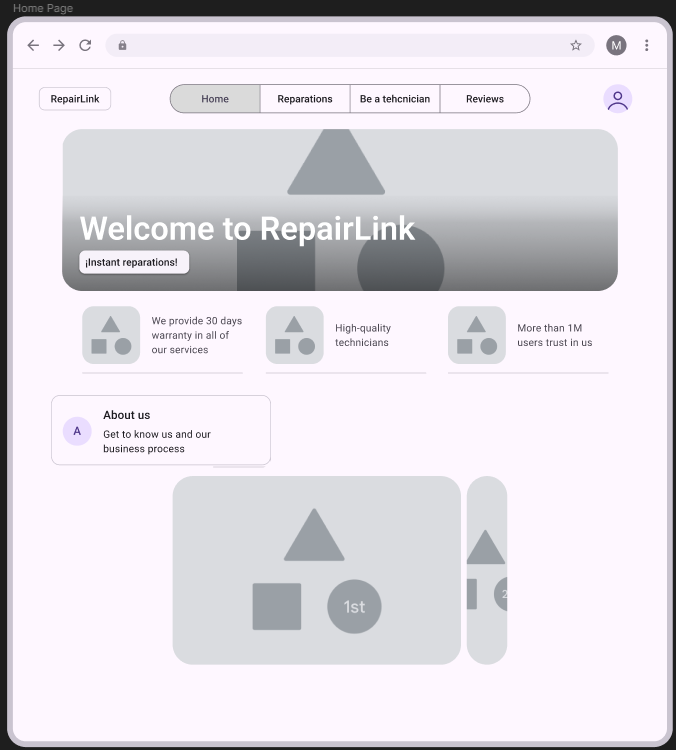

# Capítulo V: Product Implementation, Validation & Deployment

## 5.1. Software Configuration Management

A continuación, se presentará un repositorio central y organizado que servirá como guía para el desarrolloenfocado y consistente de nuestra solución.

### 5.1.1. Software Development Environment Configuration

En esta sección se incluyen los enlaces a las aplicaciones y productos de software desarrollados a lo largo del ciclo del proyecto, utilizando los programas correspondientes. Para ello, se organizará en las siguientes secciones: 

Project Mangement:
 
-Trello es una herramienta visual que facilita la gestión de proyectos y el flujo de trabajo que el equipo de desarrollo seguirá para implementar de manera correcta las tareas de código relacionadas con la Landing Page y la aplicación web.  https://trello.com/es

Product UX/UI Design:

Esta herramienta permite desarrollar el modelo de nuestro producto de manera digital, integrándose así a la experiencia del consumidor. En este caso, se utilizará para crear un modelo de sitio web adaptable tanto para computadoras como para dispositivos móviles.

-Uxpressia: es una herramienta en línea para el mapeo de la trayectoria del cliente, que permite crear mapas de impacto y personas. Sus herramientas nos ayudaron a establecer las bases para el modelado de User Persona, Empathy Map y Journey Map. https://uxpressia.com/

-Miro: es una pizarra digital colaborativa en línea, utilizada para actividades como la investigación, la ideación, la generación de lluvias de ideas, la creación de mapas mentales y diversas otras tareas colaborativas.
https://miro.com/es

-Figma: es una herramienta de prototipado web y editor de gráficos vectoriales que, a diferencia de otras herramientas, se encuentra alojada en la web. Esto permite crear modelos adaptables tanto para la versión en navegador web como para navegador móvil. https://www.figma.com/

Software Development:

Es una estructura utilizada para guiar la creación de un producto de software. Su propósito es definir un proceso que oriente el desarrollo, describiendo distintos enfoques según las actividades que se llevan a cabo a lo largo del ciclo de vida del software.

-Github: Es un repositorio comunitario que nos permite colaborar en proyectos de software, almacenar código, compartirlo y gestionar los cambios a lo largo del tiempo. 

-HTML: es un lenguaje fundamental para quienes desarrollan sitios web. Su función principal es trabajar con hipertextos, permitiendo crear enlaces hacia otros documentos en la red. Además, proporciona las herramientas necesarias para diseñar la estructura y el contenido visual de una página web.

-CSS: es un lenguaje de diseño gráfico que se utiliza para definir y controlar la presentación visual de un documento escrito en un lenguaje de marcado como HTML o XML.

### 5.1.2. Source Code Management

A continuación, se describe la administración del código fuente. Su objetivo principal es llevar un registro de todos los cambios que el equipo realice en los archivos de código de sus proyectos, dentro de los repositorios designados. Se utilizará como un sistema de control de versiones, lo que permitirá rastrear las modificaciones que cada miembro  implemente en el proyecto. Es importante destacar que para este sistema de control de versiones se empleará GitHub. 

Repositorio : https://github.com/1ASI0730-2510-4370-G5-RepairLink

Web Services Repository: https://1asi0730-2510-4370-g5-repairlink.github.io/LandingPage/

ESQUEMA DE CONTROL DE VERSIONES:

-Rama principal (main): Contendrá siempre la versión estable de la aplicación.

-Rama de desarrollo (develop): Servirá como rama integradora para el desarrollo de nuevas características y cambios no verificados.

-Ramas de características (feature branches): Cada nueva funcionalidad se desarrollará en una rama propia, siguiendo la convención de nombres como feature/<nombre-de-la-caracteristica>.

-Ramas de corrección de errores (hotfix branches): En caso de problemas críticos en producción, se utilizarán ramas de corrección rápida, denominadas hotfix/<descripcion-del-arreglo>.

-Ramas de liberación (release branches): Para preparar las versiones estables y nuevas funcionalidades, se creará una rama release/<version> para realizar pruebas y ajustes finales antes de la liberación.

GITFLOW Y CONVENCIONES DE COMMITS:

El equipo implementará el flujo de trabajo GitFlow como modelo para el control de versiones. Además, se utilizarán las convenciones Conventional Commits para los mensajes de commit, siguiendo las siguientes directrices:

-feat: para nuevas características.

-fix: para correcciones de errores.

-docs: para cambios en la documentación.

-style: para modificaciones en la apariencia del código sin cambios de funcionalidad.

-refactor: para mejoras del código que no afectan su funcionalidad.

### 5.1.3. Source Code Style Guide & Conventions

Para mantener nuestro código limpio, uniforme , en este proyecto utilizaremos la Guía de Estilo de Google para HTML/CSS. Esta guía nos ayudará a escribir código HTML y CSS de manera clara y organizada. Algunas de las reglas que seguiremos son:

-Usaremos solo dos espacios para la indentación, tanto en HTML como en CSS. Esto hace que el código sea fácil de leer sin que ocupe demasiado espacio horizontal.

-Ordenaremos los selectores de CSS de forma lógica: primero los selectores de elementos (tipo), luego los de ID y al final los de clase.

-Elegiremos nombres de clase cortos pero que expliquen bien su función, usando guiones bajos para separar las palabras y facilitar la lectura.

-Añadiremos comentarios solo cuando sea necesario aclarar reglas de CSS que no sean obvias a primera vista.

Esta sección describe el estilo y las convenciones del código fuente que se observan en este proyecto web para garantizar la coherencia y la mantenibilidad.

## 1. Convenciones de HTML:

* **Indentación:** El código HTML utiliza una indentación de **cuatro espacios** para los elementos anidados, lo que mejora la legibilidad y la estructura.
* **HTML Semántico:** El código emplea elementos HTML5 semánticos como `<header>`, `<nav>`, `<main>`, `<section>` y `<footer>` para definir claramente la estructura y el propósito de las diferentes partes de la página web.
* **Nomenclatura de Clases:** Los nombres de las clases CSS son generalmente descriptivos y utilizan minúsculas con guiones para separar las palabras (por ejemplo, `hero-box`, `segmented-container`, `language-switcher`).
* **Image Handling:** Las etiquetas `` incluyen el atributo `alt` para proporcionar texto alternativo para la accesibilidad y en caso de que la imagen no se pueda cargar.
* **Navegación:** El elemento `<nav>` se utiliza para la navegación principal, y se emplean atributos `aria-label` para mejorar la accesibilidad. Los botones dentro de la navegación también utilizan `aria-label` para una mejor compatibilidad con lectores de pantalla.

## 2. Convenciones de CSS:

* **Nomenclatura de Selectores:** Los selectores de CSS utilizan principalmente nombres de clase descriptivos en minúsculas, separando palabras con guiones (kebab-case), lo que coincide con las clases utilizadas en el HTML.

* **Organización:** El CSS está organizado en secciones lógicas, con comentarios que indican el propósito de cada sección (por ejemplo, `/*MIDDLE-REVIEWS*/`, `/*REPARATIONS*/`, `/*GOOFY AHH CONTAINER*/`, `/* Header Right Container */`, `/* Language Switcher Styles (updated) */`, `/* Logo-Account */`).

* **Indentación:** Las reglas de estilo dentro de cada selector están indentadas con **cuatro espacios** para mejorar la legibilidad.

* **Propiedades y Valores:** Las propiedades CSS se escriben en minúsculas, y los valores utilizan las convenciones estándar (por ejemplo, valores hexadecimales en minúsculas `#fcead2`, unidades como `px`, `%`, `em`).

* **Uso de `font-family`:** Se definen claramente las fuentes utilizando la propiedad `font-family`, incluyendo una fuente principal y una fuente de respaldo (`'Roboto', sans-serif` y `'Roboto Slab', serif`).

* **Modelo de Caja:** Se utilizan propiedades como `margin`, `padding`, `border`, `width`, `height` y `box-shadow` para definir el diseño y la apariencia de los elementos.

* **Flexbox:** Se utiliza ampliamente Flexbox (`display: flex`, `flex-direction`, `align-items`, `justify-content`, `flex-wrap`, `gap`) para la disposición y el alineamiento de los elementos, tanto en el encabezado, la navegación, las secciones principales y el pie de página.

* **Posicionamiento:** Se utiliza `position: fixed` para el encabezado y el pie de página, y `position: absolute` para elementos dentro de ellos.

* **Z-index:** Se utiliza `z-index` para controlar el orden de apilamiento de elementos posicionados (`header`, `footer`).

* **Pseudo-elementos:** Se utilizan pseudo-elementos (`::after`, `::before`) para añadir elementos visuales (líneas divisorias) sin necesidad de HTML adicional.

* **Media Queries:** Se incluye una media query (`@media (max-width: 768px)`) para aplicar estilos específicos en pantallas más pequeñas, lo que indica un enfoque en el diseño responsivo.

* **Transiciones:** Se utiliza la propiedad `transition` para crear efectos visuales suaves al interactuar con los elementos (por ejemplo, en los botones de navegación y los botones de idioma).

* **Colores:** Se utilizan valores hexadecimales y `rgb()` para definir los colores de fondo, texto y bordes.

### 5.1.4. Software Deployment Configuration

En esta sección se detalla el proceso de despliegue de los productos digitales desarrollados para la solución. A partir de los repositorios de código fuente en GitHub, el despliegue de cada componente se realizará de la siguiente manera:

*Landing Page:
HTML: sirve de referencia del software que interactúa con la elaboración de páginas web en sus diferentes versiones.

Evidencia: Archivos HTML, el principal es index.html donde todos los integrantes juntaron el contenidorealizado en su rama individual.

 

Css: Es aquel que nos ayudó con el diseño gráfico para que el Landing Page sea agradable e interactiva.

Evidencia: Se presenta el file styles.css, donde el grupo implemento el diseño de toda la estructura realizada con html.

Todo el despliegue fue gracias a las siguientes herramientas:

-GitHub: Plataforma de desarrollo colaborativo.

-Git Flow: Nos permitió controlar el avance de cada uno de nuestros integrantes con respecto aldesarrollo del Landing Page.

-Git Hub Pages: Servicio de Github que nos permitió alojar nuestra Landing page.

Evidencia de deployment: 

## 5.2. Landing Page, Services & Applications Implementation

La implementación de la solución digital se realizó bajo una arquitectura distribuida basada en servicios, en concordancia con los lineamientos definidos durante la etapa de diseño. Esta sección documenta el proceso de desarrollo, pruebas, documentación técnica y despliegue de los componentes clave: Landing Page, Servicios Web (RESTful API) y la Aplicación Web Frontend.

Para asegurar una experiencia de usuario consistente e intuitiva, se diseñaron las interfaces en Figma, utilizando un enfoque centrado en el usuario. Este prototipo de alta fidelidad sirvió como guía visual durante el desarrollo, asegurando la alineación entre lo diseñado y lo implementado. El prototipo puede consultarse en el siguiente enlace:

 https://www.figma.com/design/VMTUTmSN9k1qX1JiXnVIgR/App-Web?node-id=6-14359

El desarrollo se organizó en sprints conforme a un enfoque ágil, permitiendo iterar y validar avances progresivamente con base en el Product Backlog. A continuación, se detallan los avances realizados por sprint, incluyendo las tareas ejecutadas, funcionalidades implementadas, pruebas realizadas y despliegues correspondientes.

### 5.2.1. Sprint 1
#### 5.2.1.1. Sprint Planning 1
SPRINT 1:

SPRINT PLANNING BACKGROUND

Date: 06-04-2025

Time: 8:00 pm

Location: Via virtual por Google Meet

Prepared By: Karen Stephanie Ramos Carpio

Attendees (to planning meeting): Sebastian Cordova Valdivia,Stanley Jeremy Gutierrez Tume,Edson Diego Llamozas Diaz,José Luis Martinez Valdivia,Karen Stephanie Ramos Carpio.

Sprint 1 - Review Summary: Durante la primera reunión del Sprint, el equipo se enfocó en definir las tareas y responsabilidades de cada miembro, asegurando que todos estuvieran alineados con los objetivos del informe a desarrollar y cualquier duda acerca del desarrollo hacernoslo saber por nuestro chat de whatsapp.

Sprint 1– Retrospective Summary: En esta retrospectiva, el equipo discutió cómo se llevó a cabo la planificación del Sprint y la distribución de tareas.Todos los participantes lograron hacer su parte del trabajo , ya que corregimos algunos puntos que nos parecían que se podían mejorar.

Sprint Goal & User Stories: -

Sprint 1 goal: Diseñar e implementar el Landing Page con el objetivo de concretar nuestra propuesta de valor.

Sprint 1 Velocity: 12

Sum of Story Points:12

#### 5.2.1.2. Sprint Backlog 1
En esta sección se muestran los tasks que se realizaron en el presente sprint:

| Story ID | Título                        | Descripción breve                                              | Estimación (Story Points) | Estado      | Responsable                         |
|----------|-------------------------------|-----------------------------------------------------------------|----------------------------|-------------|-------------------------------------|
| US-001   | Landing Page - Home           | Página inicial con descripción y botón de acción.              | 3                          | Completado  | Karen Ramos                         |
| US-002   | Sección - Reparaciones        | Información visual sobre tipos de reparaciones disponibles.    | 2                          | Completado  | Sebastián Córdova                   |
| US-003   | Sección - Reseñas             | Mostrar testimonios y calificaciones de clientes.              | 2                          | Completado  | Stanley Gutiérrez                   |
| US-004   | Sección - Sé un Técnico       | Explicación sobre cómo registrarse como técnico.                | 2                          | Completado  | Edson Llamozas                      |
| US-005   | Sección - Contacto            | Formulario de contacto para dudas y comentarios.               | 3                          | Completado  | José Luis Martínez                  |

**Sprint Goal:** Diseñar e implementar el Landing Page con el objetivo de concretar nuestra propuesta de valor.  
**Sprint Velocity:** 12 puntos  
**Fecha del Sprint:** 06-04-2025  

#### 5.2.1.3. Development Evidence for Sprint Review

En este apartado se presentará la documentación que respalda el desarrollo y los avances del software. Se describirán las funcionalidades concretas implementadas en el sprint en curso, haciendo hincapié en los logros más destacados alcanzados en la plataforma.

#### 5.2.1.4. Execution Evidence for Sprint Review

Durante este Sprint, se completó la implementación del diseño y la estructura básica de la Landing Page para el proyecto RepairLink, utilizando los avances de diseño de Figma. A continuación, se presentan las vistas clave de la Landing Page.

#### 5.2.1.5. Services Documentation Evidence for Sprint Review

Con el objetivo de documentar adecuadamente la implementación de los servicios, se utilizaron herramientas de diseño y desarrollo enfocadas en la creación de la Landing Page de RepairLink.

Herramientas utilizadas:

Figma: Utilizado para la elaboración del prototipo de alta fidelidad de la Landing Page, documentando tanto la estructura visual como las interacciones básicas.

HTML y CSS: Empleados para implementar el diseño de forma estructurada y estilizada, asegurando buenas prácticas de codificación y adaptabilidad responsive.

Evidencias de documentación:

Prototipo en Figma: Se desarrolló un prototipo navegable que refleja la organización y el flujo de navegación de la Landing Page.

Enlace al prototipo en Figma: https://www.figma.com/design/VMTUTmSN9k1qX1JiXnVIgR/App-Web?node-id=6-14359&t=MIHuxbVO7Yhjmu4I-1

Tipografía :

En RepairLink se seleccionó una tipografía que equilibra elegancia y funcionalidad, reforzando la identidad visual de la aplicación. La fuente principal utilizada es Roboto, reconocida por su excelente legibilidad en dispositivos móviles y su estilo moderno y profesional. Para generar contraste en los textos y resaltar información relevante, se incorporó la fuente Roboto Slab, que aporta un aspecto llamativo y ayuda a captar la atención del usuario.

Espaciados y márgenes consistentes para mejorar la experiencia de usuario.

Estilos de botones y formularios acorde al diseño.

#### 5.2.1.6. Software Deployment Evidence for Sprint Review

Durante el Sprint 1, el equipo no realizó despliegues en ambientes de prueba o producción. Sin embargo, se avanzó en la planificación del proceso de deployment para los productos involucrados: Landing Page, Web Applications y Web Services.

El enfoque de este Sprint se centró en establecer la base técnica para permitir un deployment ágil en próximos sprints. Se definieron herramientas y proveedores potenciales, así como una estructura de proyecto que facilitará futuras automatizaciones e integraciones.

Acciones realizadas durante el Sprint 1

Actividad	Descripción

-Configuración de repositorios	Se estructuró el repositorio principal en GitHub para facilitar integración y control de versiones de los productos: Landing Page, Web App y Web Services.

-Evaluación de servicios cloud	Se evaluaron opciones como GitHub Pages (para Frontend), Render y Railway (para Backend) para realizar despliegues en los próximos sprints.

-Estructura de carpetas para CI/CD	Se organizaron las carpetas del repositorio con vistas a una futura integración con GitHub Actions para automatizar el proceso de deployment.

-Validación local	La Landing Page fue ejecutada y validada en entorno local como preparación para su futura publicación.

#### 5.2.1.7. Team Collaboration Insights during Sprint

Durante el Sprint 1, el equipo trabajó de manera colaborativa enfocándose principalmente en el diseño y la implementación inicial de la Landing Page. Se distribuyeron tareas según los perfiles técnicos y se empleó GitHub como principal herramienta para el control de versiones, seguimiento de commits y colaboración en el desarrollo.

Cada miembro del equipo contribuyó activamente con tareas específicas relacionadas con el desarrollo, la revisión de código, la estructuración de carpetas y la organización del repositorio. Además, se mantuvo una comunicación fluida mediante reuniones de planificación y seguimiento, apoyadas por Google Meet.

### 5.2.2. Sprint 2
#### 5.2.2.1. Sprint Planning 2
SPRINT 2:

SPRINT PLANNING BACKGROUND

Date: 01-05-2025

Time: 7:00 pm

Location: Via virtual por Google Meet

Prepared By: Karen Stephanie Ramos Carpio

Attendees (to planning meeting): Sebastian Cordova Valdivia,Stanley Jeremy Gutierrez Tume,Edson Diego Llamozas Diaz,José Luis Martinez Valdivia,Karen Stephanie Ramos Carpio.

Sprint 2 - Review Summary: Durante la primera reunión del Sprint, el equipo se enfocó en definir las tareas y responsabilidades de cada miembro, asegurando que todos estuvieran alineados con los objetivos del informe a desarrollar y cualquier duda acerca del desarrollo hacernoslo saber por nuestro chat de whatsapp.

Sprint 2– Retrospective Summary: En esta retrospectiva, el equipo discutió cómo se llevó a cabo la planificación del Sprint y la distribución de tareas.Todos los participantes lograron hacer su parte del trabajo , ya que corregimos algunos puntos que nos parecían que se podían mejorar.

Sprint Goal & User Stories: -

Sprint 2 goal: Diseñar e implementar el FrontEnd del Aplicativo Web.

Sprint 1 Velocity: 12

Sum of Story Points:31
#### 5.2.2.2. Sprint Backlog 2

En esta sección se muestran los tasks que se realizaron en el presente sprint:

| Story ID | Título                        | Descripción breve                                              | Estimación (Story Points) | Estado      | Responsable                         |
|----------|-------------------------------|-----------------------------------------------------------------|----------------------------|-------------|-------------------------------------|
| US-006   | Registro rápido de usuario           | Página inicial con descripción y botón de acción.              | 3 | Completado  | Karen Ramos                         |
| US-007   | Crear perfil profesional técnico     | Información visual sobre tipos de reparaciones disponibles.    | 2  | Completado  | Sebastián Córdova                   |
| US-008   | Carga de documentos de validación    | Información visual sobre tipos de reparaciones disponibles.    | 2  | Completado  | Sebastián Córdova                  |
| US-009   | Login de usuario                     | Página inicial con descripción y botón de acción.              | 3 | Completado  | Karen Ramos                         |
| US-010   | Login de técnico                     | Información visual sobre tipos de reparaciones disponibles.    | 2  | Completado  | Sebastián Córdova                   |
| US-011   | Subir información del dispositivo    | Mostrar testimonios y calificaciones de clientes.              | 2  | Completado  | Stanley Gutiérrez |
| US-012   | Recibir presupuestos                 | Explicación sobre cómo registrarse como técnico.               | 2 | Completado  | Edson Llamozas                      |
| US-013   | Ver reputacion de técnicos           | Formulario de contacto para dudas y comentarios.               | 3 | Completado  | José Luis Martínez                  |
| US-014   | Agendar Cita                         | Página inicial con descripción y botón de acción.              | 3 | Completado  | Karen Ramos                         |
| US-015   | Enviar presupuestos                  | Información visual sobre tipos de reparaciones disponibles.    | 2 | Completado  | Sebastián Córdova                   |
| US-016   | Gestión de citas y clientes          | Mostrar testimonios y calificaciones de clientes.              | 2 | Completado  | Stanley Gutiérrez |
| US-017   | Facturación                          | Explicación sobre cómo registrarse como técnico.               | 2 | Completado  | Edson Llamozas                      |
| US-018   | Ver reputacion de técnicos           | Formulario de contacto para dudas y comentarios.               | 3 | Completado  | José Luis Martínez                  |

**Sprint Goal:** Diseñar e implementar el FrontEnd con el objetivo de concretar nuestra propuesta de valor.  
**Sprint Velocity:** 12 puntos  
**Fecha del Sprint:** 02-05-2025  

#### 5.2.2.3. Aspect Leaders and Collaborators
|Team Member | GitHub Username |  Delegating Responsibilities   Leader (L) / Collaborator (C) | Merging Branches  Leader (L) /Collaborator (C)| Correcting Mistakes   Leader (L) /Collaborator (C)|
|-------------|--------------|------------|----------|----------|
| Jose Luis Martinez Validiva | hmongus  |    L   |    L     | C  |
| Sebastian Cordova Valdivia	 | Sevas04  |    C   |     C    | C  |
| Stanley Jeremy Gutierrez Tume	 | Stan-gt213891  |  C     |   C      |  C  |
| Edson Diego Llamozas Diaz	 | DiegoLlamozas  |    C   |    C     |   C   |
| Karen Stephanie Ramos Carpio	 | KarenRamos2  |   C    |    C     |   L   |

#### 5.2.2.4. Development Evidence for Sprint Review

A continuación se presentan informacion de los commits del FrontedEnd con el uso de PrimeVue, CSS, JavaScript y Vue:

| Repository   | Branch   | Commit Id                                | Commit Message                                                        | Commited on         |
|--------------|----------|------------------------------------------|------------------------------------------------------------------------|--------------------|
|  Frontend    | feature/develop      |       879ca53…1bb07de                     |  git: add my services page                                |        15/05/2025            |
|  Frontend    | feature/Signup-LogIn  |       4b77e11…676edda                    | git: add functional login-page                             |                    |
|  Frontend    | feature/appointments  |      735b2a7                             | appointment vue components                                 |      15/05/2025              |
|  Frontend    | feature/service-customer  |        879ca53…2388dae                   |feat: initial commit                                     |      15/05/2025                    |
|  Frontend    | feature/Signup-LogIn  |        891c35a…4b77e11                   |git: add specialty page                                     |        14/05/2025             |
|  Frontend    | feature/home-technician  |         879ca53                   |git: initial commit                                      |    14/05/2025                |
|  Frontend    | feature/Signup-LogIn  |        93a14e9…891c35a                   |git: git: add sigunp page                                   |     13/05/2025                |
|  Frontend    | feature/Signup-LogIn  |        879ca53…93a14e9                   |git: add welcome and login page                               |   13/05/2025                  |

#### 5.2.2.5. Execution Evidence for Sprint Review
Durante este sprint se completaron importantes avances en la ejecución del Front-End de **RepairLink** utilizando **Vue.js**. Se implementaron vistas clave como el registro e inicio de sesión tanto para usuarios como técnicos, la creación del perfil profesional del técnico, la vista principal del cliente, su panel de servicios y el perfil del usuario cliente.

Estas funcionalidades consolidan la base operativa de la plataforma, permitiendo una experiencia inicial completa para ambas partes del sistema: usuarios que buscan servicios de reparación y técnicos que los ofrecen.

**Link del proyecto:** https://github.com/1ASI0730-2510-4370-G5-RepairLink/Frontend
#### 5.2.2.6. Services Documentation Evidence for Sprint Review
Para este sprint no se implemento API alguna ya que no realizo el desarrollo de un backend. Sin embargo, se realizo una FakeApi.
#### 5.2.2.7. Software Deployment Evidence for Sprint Review
Durante la realizacion de este sprint 2 se realizo el deployment de la Fake-Api y el FrontEnd realizado en VueJS. Los servicios usados para estos fueron los siguientes respectivamente:

- Render:  
 

 

- Netlify:  

 

- Video Implementacion: https://shorturl.at/MaTQ7  

 
#### 5.2.2.8. Team Collaboration Insights during Sprint
