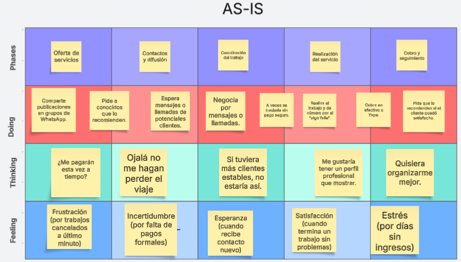

# Capítulo II: Requirements Elicitation & Analysis

## 2.1. Competidores.

<h2><li>MaintainX:</li></h2> 
Descripción:MaintainX es una plataforma digital centrada en la gestión de mantenimiento, inspecciones y operaciones de primera línea. Su aplicación móvil permite a los equipos registrar, ejecutar y dar seguimiento a órdenes de trabajo en tiempo real. Está orientada principalmente a sectores industriales, manufactureros, hospitalarios y de instalaciones, con un enfoque en eficiencia operativa y cumplimiento de normativas.  
<h3><li>Modelo de negocio:</li></h3>  MaintainX opera bajo un modelo SaaS (Software as a Service), con planes de suscripción mensual por usuario. Ofrece diferentes niveles de funcionalidad (básico a empresarial) y está enfocado en empresas que requieren digitalizar procesos de mantenimiento preventivo, correctivo y predictivo, a través de dispositivos móviles y en la nube.. 
<h2><li>OpenRMA:</li></h2> 
Descripción: OpenRMA es un software de gestión para servicios técnicos que permite controlar el flujo completo de órdenes de reparación, inventario, clientes y facturación. Está diseñado para talleres y centros de servicio que manejan productos en garantía o fuera de garantía. Su enfoque es facilitar el proceso de retorno y mantenimiento de productos a través de una interfaz clara y funcional. 
<h3><li>Modelo de negocio:</li></h3>  OpenRMA combina un modelo de licencia de pago único para su versión de escritorio (Windows) con una alternativa en la nube mediante suscripción mensual. Esta estructura híbrida permite a pequeñas empresas elegir entre una solución económica sin pagos recurrentes o una plataforma en línea con respaldo y actualizaciones continuas. 
<h2><li>Repero</li></h2> 
Descripción: Repero es una plataforma especializada en la gestión de servicios técnicos y reparaciones, que permite registrar tickets, gestionar inventario, seguir el estado de las reparaciones y emitir reportes personalizados. Está orientado a negocios de reparación de electrónica, electrodomésticos o tecnología, facilitando una atención rápida y organizada al cliente final.  
<h3><li>Modelo de negocio:</li></h3> Repero funciona como software en la nube con acceso bajo suscripción. Su modelo SaaS permite a los usuarios acceder desde cualquier dispositivo con conexión a internet, y escalar el servicio según el volumen de órdenes o número de técnicos, con herramientas específicas para talleres de reparación pequeños y medianos.  

### 2.1.1. Análisis competitivo.

<table>
  <thead>
    <tr>
      <th colspan="6" style="text-align: center">
        <h2>Competitive Analysis Landscape</h2>
      </th>
    </tr>
  </thead>
  <tbody>
    <tr>
      <td colspan="2" rowspan="2" align="center">¿Por qué llevar a cabo este análisis?</td>
      <td colspan="4" align="center">
        ¿Quiénes son nuestros principales competidores?
      </td>
    </tr>
    <tr>
      <td colspan="4" align="center">
        Este análisis permite conocer el ecosistema competitivo, identificando fortalezas y debilidades de plataformas similares. Nos brinda la posibilidad de tomar decisiones estratégicas y posicionar nuestro producto de forma diferenciada en el mercado.
      </td>
    </tr>
    <tr>
      <td rowspan="3" align="center">Perfil</td>
      <td align="center">Overview</td>
      <td align="center">RepairLink </td>
      <td align="center">MaintainX </td>
      <td align="center">OpenRMA </td>
      <td align="center">Repero </td>
    </tr>
    <tr>
      <td align="center">Descripción</td>
      <td align="center">
        Plataforma integral que conecta técnicos con clientes, permite gestionar perfiles, habilidades técnicas, agendamiento de servicios y control de usuarios en tiempo real.
      </td>
      <td align="center">
        Plataforma móvil y web para gestión de mantenimiento preventivo, órdenes de trabajo e inspecciones.
      </td>
      <td align="center">
        Software RMA para gestión de reparaciones, inventario y tickets en talleres técnicos.
      </td>
      <td align="center">
        Herramienta en la nube para registrar reparaciones, clientes, inventario y generar reportes.
      </td>
    </tr>
    <tr>
      <td align="center">Modelo de negocio</td>
      <td align="center">
        SaaS con acceso gratuito básico y planes premium escalables para técnicos y empresas.
      </td>
      <td align="center">SaaS (suscripción mensual por usuario)</td>
      <td align="center">Licencia de pago único (desktop) o suscripción (cloud)</td>
      <td align="center">Suscripción mensual basada en la nube</td>
    </tr>
    <tr>
      <td rowspan="2" align="center">Perfil de marketing</td>
      <td align="center">Mercado objetivo</td>
      <td align="center">
        Técnicos independientes, empresas de mantenimiento, hogares y oficinas.
      </td>
      <td align="center">
        Empresas industriales, hospitales y fábricas.
      </td>
      <td align="center">
        Talleres técnicos, servicios postventa.
      </td>
      <td align="center">
        Técnicos de electrónica y electrodomésticos.
      </td>
    </tr>
    <tr>
      <td align="center">Estrategias de marketing</td>
      <td align="center">
        <ul>
          <li>Landing page con validación de técnicos</li>
          <li>Marketing digital dirigido</li>
        </ul>
      </td>
      <td align="center">
        <ul>
          <li>Inbound B2B</li>
          <li>SEO y demos</li>
        </ul>
      </td>
      <td align="center">
        <ul>
          <li>Presencia en software directories</li>
        </ul>
      </td>
      <td align="center">
        <ul>
          <li>Publicidad en buscadores</li>
        </ul>
      </td>
    </tr>
    <tr>
      <td rowspan="3" align="center">Perfil del producto</td>
      <td align="center">Productos & Servicios</td>
      <td align="center">
        Autenticación, perfiles de usuario, agenda de servicios, panel para técnicos y clientes.
      </td>
      <td align="center">
        Órdenes de trabajo, mantenimiento, inspecciones, reportes.
      </td>
      <td align="center">
        Gestión de reparaciones, inventario y tickets.
      </td>
      <td align="center">
        CRM básico con control de inventario y tickets.
      </td>
    </tr>
    <tr>
      <td align="center">Precios & Costos</td>
      <td align="center">
        <ul>
          <li>Plan gratuito para usuarios</li>
          <li>Desde S/. 19.90 para técnicos</li>
          <li>Planes empresariales desde S/. 99.90</li>
        </ul>
      </td>
      <td align="center">USD 16–99/usuario/mes</td>
      <td align="center">Desde USD 149 (único) o suscripción mensual</td>
      <td align="center">Desde USD 12/usuario/mes (aprox.)</td>
    </tr>
    <tr>
      <td align="center">Canales de distribución</td>
      <td align="center">Web (Vue + .NET API); futura app móvil</td>
      <td align="center">App móvil y web</td>
      <td align="center">Software desktop o cloud</td>
      <td align="center">Web responsive</td>
    </tr>
    <tr>
      <td rowspan="4" align="center">Análisis SWOT</td>
      <td align="center">Fortalezas</td>
      <td align="center">
        <ul>
          <li>Validación de técnicos</li>
          <li>Arquitectura moderna</li>
          <li>Agenda inteligente</li>
        </ul>
      </td>
      <td align="center">
        <ul>
          <li>Móvil y escalable</li>
          <li>Interfaz moderna</li>
        </ul>
      </td>
      <td align="center">
        <ul>
          <li>Sin pagos mensuales (versión desktop)</li>
        </ul>
      </td>
      <td align="center">
        <ul>
          <li>Simple para pymes</li>
        </ul>
      </td>
    </tr>
    <tr>
      <td align="center">Debilidades</td>
      <td align="center">
        <ul>
          <li>Marca nueva</li>
          <li>No está aún en stores</li>
        </ul>
      </td>
      <td align="center">
        <ul>
          <li>Costo elevado para pymes</li>
        </ul>
      </td>
      <td align="center">
        <ul>
          <li>Diseño poco moderno</li>
        </ul>
      </td>
      <td align="center">
        <ul>
          <li>Poca diferenciación</li>
        </ul>
      </td>
    </tr>
    <tr>
      <td align="center">Oportunidades</td>
      <td align="center">
        <ul>
          <li>Integración con IA</li>
          <li>Mercado desatendido en LATAM</li>
        </ul>
      </td>
      <td align="center">
        <ul>
          <li>Expansión a nuevos sectores</li>
        </ul>
      </td>
      <td align="center">
        <ul>
          <li>Mejorar UI/UX</li>
        </ul>
      </td>
      <td align="center">
        <ul>
          <li>Agregar más funcionalidades</li>
        </ul>
      </td>
    </tr>
    <tr>
      <td align="center">Amenazas</td>
      <td align="center">
        <ul>
          <li>Competencia consolidada como OpenRMA o Fiverr</li>
        </ul>
      </td>
      <td align="center">
        <ul>
          <li>Alta competencia en mantenimiento</li>
        </ul>
      </td>
      <td align="center">
        <ul>
          <li>Falta de actualizaciones</li>
        </ul>
      </td>
      <td align="center">
        <ul>
          <li>Apps gratuitas similares</li>
        </ul>
      </td>
    </tr>
  </tbody>
</table>

### 2.1.2. Estrategias y tácticas frente a competidores.

En base al análisis competitivo efectuado anticipadamente, se logró identificar con exactitud las fortalezas, oportunidades, debilidades y amenazas destacadas de los competidores. Dicha información resulta ser clave para trazar estrategias y tácticas de superación hacia la competencia, cuando el servicio entre al mercado (lanzamiento rentable). A continuación, se brindará una serie de estrategias y tácticas trazadas para alcanzar esta meta:

### Afrontando las fortalezas de los competidores
- Fortalezas detectadas en la competencia:
MaintainX: amplia funcionalidad en órdenes de trabajo, escalabilidad y experiencia en grandes industrias.
OpenRMA: solución madura con buena gestión de tickets y control de inventario.
Repero: herramienta simple para técnicos, con funcionalidades de CRM y reportes rápidos.
- Fortalezas propias de RepairLink:
Validación de técnicos, permitiendo confianza para los clientes.
Agenda inteligente y moderna adaptada a servicios a domicilio o corporativos.
Arquitectura tecnológica escalable (frontend Vue.js + backend .NET).
- Estrategia:
Enfatizar el valor de conectar técnicos confiables con clientes a través de una interfaz moderna y verificada.
- Tácticas:
Integrar dashboards visuales para técnicos y clientes, con estadísticas claras de desempeño y disponibilidad.
Promocionar la seguridad del sistema de validación mediante casos de éxito.
Destacar la usabilidad como elemento diferenciador frente a interfaces más rígidas de competidores.

### Superando las debilidades de los competidores
- Debilidades detectadas en la competencia:
OpenRMA tiene una interfaz antigua y poco intuitiva.
Repero carece de diferenciadores y cobra por funciones comunes.
MaintainX es costoso para pequeñas empresas.
- Debilidades reconocidas en RepairLink:
Aún no está disponible en tiendas de aplicaciones móviles.
Marca emergente en etapa inicial de posicionamiento.
- Estrategia:
Corregir proactivamente errores, mantener una plataforma estable y enfocarse en la experiencia de usuario.
- Tácticas:
Crear un sistema de soporte integrado para el reporte de errores.
Ofrecer tutoriales interactivos y documentación accesible para usuarios nuevos.
Liberar una versión progresiva de la app móvil con funcionalidades clave.

### Aprovechando las oportunidades del mercado
- Oportunidades en el entorno competitivo:
Bajo enfoque en LATAM por parte de los competidores actuales.
Falta de personalización en servicios de mantenimiento técnico general.
Demanda creciente de plataformas que conecten técnicos con hogares u oficinas.
- Oportunidades propias de RepairLink:
Ser pionero en el enfoque local y personalizado en Perú y LATAM.
Ofrecer una solución digital con doble cara: para técnicos y clientes.
- Estrategia:
Posicionar RepairLink como una plataforma confiable, accesible y adaptada a la realidad latinoamericana.
- Tácticas:
Aplicar pruebas de usabilidad con técnicos locales y recopilar feedback en tiempo real.
Diseñar la interfaz con principios de accesibilidad y estética moderna.
Incluir secciones informativas para construir confianza y educar al cliente final.

### Enfrentando las amenazas externas
- Amenazas comunes detectadas:
MaintainX domina grandes cuentas empresariales con presupuesto alto.
Repero y OpenRMA ya tienen usuarios establecidos.
La competencia puede reaccionar con mejoras similares si detecta el crecimiento de RepairLink.
- Amenazas internas identificadas:
Alta competencia en el sector técnico/servicios.
Posible lentitud en la adopción por parte de técnicos tradicionales.
- Estrategia:
Diferenciarse por funcionalidad orientada a técnicos independientes y pymes, con precios accesibles y soporte inmediato.
- Tácticas:
Mantener iteraciones frecuentes de producto y mejoras constantes.
Organizar webinars, demostraciones y campañas educativas.
Crear alianzas con instituciones técnicas o ferias del sector para obtener usuarios de forma orgánica.

## 2.2. Entrevistas.
### 2.2.1. Diseño de entrevistas.

#### Cuestionario de Gestión de Reparaciones

- ¿En qué tipo de reparaciones está especializado?  
- ¿Cuántos trabajos realiza al mes?  
- ¿Qué herramientas/software utiliza actualmente para gestionar las reparaciones, la comunicación con los clientes y el inventario?  
- ¿Cómo controla el progreso de las reparaciones en la actualidad?  
- ¿Qué funciona bien y qué es frustrante?  
- ¿Qué es lo que más tiempo le lleva de la gestión de los trabajos de reparación?  
- ¿Cómo se comunican las actualizaciones a los clientes (por ejemplo, retrasos, finalización)?  
  - ¿Qué dificultades surgen?  
- ¿Qué funciones le gustaría que tuviera el software de gestión de reparaciones?  
- ¿Cómo resolvería esto los problemas a los que se enfrenta actualmente?  
- ¿Qué le haría dudar a la hora de cambiar sus herramientas actuales?  
- ¿Qué modelo de precios (suscripción, tarifa por trabajo) le hace sentido?  
- ¿En qué se equivocan los competidores con respecto a sus necesidades?  
- ¿Puedo ponerme en contacto con usted para una prueba beta?  

---

#### Cuestionario de Experiencia como Cliente

- ¿Cuándo fue la última vez que utilizó un servicio de reparación (coche, informática, etc.)?  
  - ¿Cómo encontró al proveedor?  
- ¿Recibió actualizaciones sobre el progreso de la reparación?  
  - En caso afirmativo, ¿cómo (mensaje de texto, correo electrónico, aplicación)?  
- ¿Está satisfecho con la comunicación?  
  - ¿Qué le frustró?  
- ¿Le haría esto más propenso a elegir un servicio de reparación?  
  - ¿Por qué sí o por qué no?  
- ¿Cómo preferiría recibir las actualizaciones?  
  - (notificaciones en la aplicación, SMS, correo electrónico)  
- ¿Pagaría más por la transparencia?  
- ¿Cuál es el mayor quebradero de cabeza al que se ha enfrentado con los servicios de reparación?  
- ¿Puedo ponerme en contacto con usted?  

### 2.2.2. Registro de entrevistas.

#### **Segmento Objetivo: Técnicos y reparadores independientes**  

**Entrevista 1**

| **Datos del entrevistado**                                                             |
|----------------------------------------------------------------------------------------|
| **Nombre:** Jhovanny Hernandez                                                         |
| **Edad:** 25                                                                           |  
| **Género:** Masculino                                                                  |  
| **Distrito:** Lince                                                                    |
| **Ocupación:** Técnico en reparaciones generales                                       |  
| **Estado Civil:** Soltero                                                              |  
| **Link de la entrevista:** [Link Entrevista](https://upcedupe-my.sharepoint.com/:v:/g/personal/u20201e493_upc_edu_pe/EVjvWFhAE5pEsBwhMZFUOo4BPuxo-onDmizq_2cMY9g_Sw?e=GzuCxI&nav=eyJyZWZlcnJhbEluZm8iOnsicmVmZXJyYWxBcHAiOiJTdHJlYW1XZWJBcHAiLCJyZWZlcnJhbFZpZXciOiJTaGFyZURpYWxvZy1MaW5rIiwicmVmZXJyYWxBcHBQbGF0Zm9ybSI6IldlYiIsInJlZmVycmFsTW9kZSI6InZpZXcifX0%3D)                                                             |
| **Inicio de la entrevista:** 00:05                                                     |  
| **Duración de la entrevista:** 05 minutos                                              |  
|                                                                | 
| **Resumen:** Jhovanny Hernández, un técnico especializado en instalaciones generales, realiza entre 15 y 20 reparaciones al mes, principalmente en áreas de electricidad, fontanería y mantenimiento preventivo. Actualmente, gestiona sus trabajos de manera manual, utilizando agendas en papel y aplicaciones básicas para la comunicación con los clientes, lo que le resulta ineficiente y frustrante. Su mayor desafío es coordinar los trabajos, controlar el progreso y gestionar el inventario de herramientas. A pesar de ser organizado, la falta de un sistema centralizado le dificulta el seguimiento de las reparaciones y las actualizaciones a los clientes. Jhovanny busca un software de gestión que le permita organizar citas, hacer un seguimiento de las reparaciones, gestionar inventarios y mantener a los clientes informados sobre los plazos y retrasos. Prefiere un modelo de suscripción mensual que sea sencillo y accesible, sin complicaciones adicionales, y estaría dispuesto a probar una versión beta de un software que se ajuste a sus necesidades.                                                                           |  

**Entrevista 2**

| **Datos del entrevistado**                                                             |
|----------------------------------------------------------------------------------------|
| **Nombre:** Braython Chuctaya Ramirez                                                  |
| **Edad:** 27                                                                           |  
| **Género:** Masculino                                                                  |  
| **Distrito:** Comas                                                                    |
| **Ocupación:** Tecnico Electricista                                                    |  
| **Estado Civil:** Soltero                                                              |  
| **Link de la entrevista:** [Link Entrevista](https://upcedupe-my.sharepoint.com/:v:/g/personal/u20201e493_upc_edu_pe/EVjvWFhAE5pEsBwhMZFUOo4BPuxo-onDmizq_2cMY9g_Sw?e=GzuCxI&nav=eyJyZWZlcnJhbEluZm8iOnsicmVmZXJyYWxBcHAiOiJTdHJlYW1XZWJBcHAiLCJyZWZlcnJhbFZpZXciOiJTaGFyZURpYWxvZy1MaW5rIiwicmVmZXJyYWxBcHBQbGF0Zm9ybSI6IldlYiIsInJlZmVycmFsTW9kZSI6InZpZXcifX0%3D)                                                               |
| **Inicio de la entrevista:** 05:08                                                     |  
| **Duración de la entrevista:** 06 minutos                                              |  
|                                                                | 
| **Resumen:** Braython Chuctaya Ramirez, un técnico electricista con 27 años, realiza entre 10 y 15 trabajos de reparación al mes, principalmente en instalaciones eléctricas residenciales y comerciales. Actualmente, gestiona sus reparaciones de forma manual, utilizando aplicaciones básicas para la comunicación con los clientes y un registro físico para controlar el inventario, lo cual le resulta poco eficiente. Se enfrenta a dificultades como la falta de centralización de la información, lo que le consume tiempo y genera confusión tanto para él como para los clientes. Braython busca un software de gestión que le permita organizar citas, controlar inventarios, hacer seguimientos de los trabajos y mejorar la comunicación con los clientes mediante recordatorios automáticos. Prefiere un modelo de suscripción mensual que sea sencillo de usar y accesible, sin complicaciones adicionales. Estaría dispuesto a probar una versión beta de un software que cumpla con estas necesidades.                                                                           |  

**Entrevista 3**

| **Datos del entrevistado**                                                             |
|----------------------------------------------------------------------------------------|
| **Nombre:** Josue Arrunategui                                                          |
| **Edad:** 28                                                                           |  
| **Género:** Masculino                                                                  |  
| **Distrito:** SJL                                                                      |
| **Ocupación:** Técnico en reparación de electrodomesticos                              |  
| **Estado Civil:** Soltero                                                              | 
| **Link de la entrevista:**  [Link Entrevista](https://upcedupe-my.sharepoint.com/:v:/g/personal/u20201e493_upc_edu_pe/EVjvWFhAE5pEsBwhMZFUOo4BPuxo-onDmizq_2cMY9g_Sw?e=GzuCxI&nav=eyJyZWZlcnJhbEluZm8iOnsicmVmZXJyYWxBcHAiOiJTdHJlYW1XZWJBcHAiLCJyZWZlcnJhbFZpZXciOiJTaGFyZURpYWxvZy1MaW5rIiwicmVmZXJyYWxBcHBQbGF0Zm9ybSI6IldlYiIsInJlZmVycmFsTW9kZSI6InZpZXcifX0%3D)                                                              |
| **Inicio de la entrevista:** 12:02                                                     |  
| **Duración de la entrevista:** 08 minutos                                              |  
|                                                                | 
| **Resumen:** Josue Arrunategui, un técnico de reparación de electrodomésticos, realiza alrededor de 20 trabajos al mes, incluyendo reparaciones de refrigeradores, lavadoras y microondas. Actualmente, gestiona las reparaciones y la comunicación con los clientes de manera manual, utilizando aplicaciones básicas y hojas de cálculo para controlar el inventario de repuestos. Josue busca un software que centralice todo el proceso, desde la gestión de citas hasta el seguimiento de trabajos y repuestos, para mejorar la eficiencia y reducir errores. Prefiere un modelo de suscripción mensual que sea fácil de usar y accesible.                                                                           |  

#### **Segmento Objetivo: Usuarios con dispositivos dañados** 

**Entrevista 1**

| **Datos del entrevistado**                                                             |
|----------------------------------------------------------------------------------------|
| **Nombre:** Ana Lucia Aguilar                                                          |
| **Edad:** 32                                                                           |  
| **Género:** Femenino                                                                   |  
| **Distrito:** Jesús María                                                              |
| **Ocupación:** Ingeniera Quimica                                                       |  
| **Estado Civil:** Casada                                                               |  
| **Link de la entrevista:** [Link Entrevista](https://upcedupe-my.sharepoint.com/:v:/g/personal/u20201e493_upc_edu_pe/EVjvWFhAE5pEsBwhMZFUOo4BPuxo-onDmizq_2cMY9g_Sw?e=GzuCxI&nav=eyJyZWZlcnJhbEluZm8iOnsicmVmZXJyYWxBcHAiOiJTdHJlYW1XZWJBcHAiLCJyZWZlcnJhbFZpZXciOiJTaGFyZURpYWxvZy1MaW5rIiwicmVmZXJyYWxBcHBQbGF0Zm9ybSI6IldlYiIsInJlZmVycmFsTW9kZSI6InZpZXcifX0%3D)                                                               |
| **Inicio de la entrevista:** 20:01                                                           |  
| **Duración de la entrevista:** 08 minutos                                                        |  
|                                                                | 
| **Resumen:** Ana Lucia Aguilar, ingeniera química de 32 años, recientemente utilizó un servicio de reparación para su coche. Encontró al proveedor a través de una recomendación de un amigo y recibió actualizaciones sobre el progreso de la reparación mediante mensajes de texto. Aunque la comunicación fue clara, Ana Lucia se sintió frustrada por la falta de detalles específicos y el tiempo de respuesta entre los mensajes. Esto no la haría más propensa a elegir ese servicio nuevamente, ya que valora la transparencia y la eficiencia en la comunicación. Prefiere recibir actualizaciones a través de notificaciones en una aplicación móvil. Aunque está dispuesta a pagar un poco más por un servicio que ofrezca mayor transparencia, el mayor quebradero de cabeza que ha enfrentado con los servicios de reparación ha sido la falta de seguimiento claro y constante. Ana Lucia está abierta a ser contactada para más detalles.                                                                           |  

**Entrevista 2**

| **Datos del entrevistado**                                                             |
|----------------------------------------------------------------------------------------|
| **Nombre:** Elizabeth Quispe                                                           |
| **Edad:** 33                                                                           |  
| **Género:** Femenino                                                                   |  
| **Distrito:** Lince                                                                    |
| **Ocupación:** Analista Programador                                                    |  
| **Estado Civil:** Soltera                                                              | 
| **Link de la entrevista:**  [Link Entrevista](https://upcedupe-my.sharepoint.com/:v:/g/personal/u20201e493_upc_edu_pe/EVjvWFhAE5pEsBwhMZFUOo4BPuxo-onDmizq_2cMY9g_Sw?e=GzuCxI&nav=eyJyZWZlcnJhbEluZm8iOnsicmVmZXJyYWxBcHAiOiJTdHJlYW1XZWJBcHAiLCJyZWZlcnJhbFZpZXciOiJTaGFyZURpYWxvZy1MaW5rIiwicmVmZXJyYWxBcHBQbGF0Zm9ybSI6IldlYiIsInJlZmVycmFsTW9kZSI6InZpZXcifX0%3D)                                                              |
| **Inicio de la entrevista:** 29:03                                                     |  
| **Duración de la entrevista:**  10 minutos                                             |  
|                                                                | 
| **Resumen:** Elizabeth Quispe, analista programador de 33 años, utilizó recientemente un servicio de reparación para su ordenador. Encontró al proveedor a través de una búsqueda en línea y recibió actualizaciones sobre el progreso de la reparación a través de correo electrónico. Aunque la comunicación fue adecuada, Elizabeth se sintió frustrada por la falta de detalles técnicos sobre las reparaciones realizadas. Esto no la haría más propensa a elegir ese servicio nuevamente, ya que prefiere una comunicación más clara y directa. Preferiría recibir las actualizaciones a través de notificaciones en una aplicación para mayor comodidad. Aunque no está dispuesta a pagar más por transparencia, su mayor quebradero de cabeza con los servicios de reparación ha sido la falta de información detallada durante el proceso. Elizabeth está dispuesta a ser contactada para más detalles.                                                                          |  

**Entrevista 3**

| **Datos del entrevistado**                                                             |
|----------------------------------------------------------------------------------------|
| **Nombre:** Marjori Chaparro                                                           |
| **Edad:**  23                                                                          |  
| **Género:** Femenino                                                                   |  
| **Distrito:** SJL Lima                                                                 |
| **Ocupación:** Diseñador Grafico                                                       |  
| **Estado Civil:** Soltera                                                              |  
| **Link de la entrevista:**  [Link Entrevista](https://upcedupe-my.sharepoint.com/:v:/g/personal/u20201e493_upc_edu_pe/EVjvWFhAE5pEsBwhMZFUOo4BPuxo-onDmizq_2cMY9g_Sw?e=GzuCxI&nav=eyJyZWZlcnJhbEluZm8iOnsicmVmZXJyYWxBcHAiOiJTdHJlYW1XZWJBcHAiLCJyZWZlcnJhbFZpZXciOiJTaGFyZURpYWxvZy1MaW5rIiwicmVmZXJyYWxBcHBQbGF0Zm9ybSI6IldlYiIsInJlZmVycmFsTW9kZSI6InZpZXcifX0%3D)                                                              |
| **Inicio de la entrevista:** 40:00                                                     |  
| **Duración de la entrevista:** 10 minutos                                              |  
|                                                                | 
| **Resumen:** Su nombre es Marjori tiene 23 años y vive en SJL Lima, solicito un servicio de reparacion hace 2 meses para su celular busco en google reseñas y vio las mas cercana con una mayor calificacion, al pasar por el proceso de reparacion recibio notificaciones via whatsapp sobre las ctulizaciones, le hubiera gustado saber mas sobre el proceso tipo notificaciones sobre la llegada de los repuestos o que ya lo habian recibido, ya que la reparacion demoro mas de lo que le habian indicado, le gustaria un servicio tranpasarente con el proceso, adicional a eso le gustaria recibir actualizaciones mediante la app, pagaria mas por la transparencia, nos indica que el mayor problema de la reparacion fue la fata de informacion y la incertirudmbre sobre cuanto tiempo demoraria.                                                                          |  

### 2.2.3. Análisis de entrevistas.

El análisis de las entrevistas reveló que los usuarios valoran una comunicación clara y continua en los servicios de reparación. Braython, Ana Lucia y Josue coincidieron en que la falta de un sistema centralizado para gestionar citas, inventarios y actualizaciones de progreso genera frustración y errores. Todos prefieren recibir notificaciones a través de aplicaciones móviles, ya que les resultan más accesibles y convenientes. Aunque están interesados en herramientas más eficientes, temen que los nuevos sistemas sean complejos o costosos. Sin embargo, estarían dispuestos a pagar un poco más por servicios que ofrezcan mayor transparencia, trazabilidad y eficiencia. La necesidad de un sistema de gestión centralizado que facilite la organización y la comunicación con los clientes es una prioridad común entre los entrevistados.

## 2.3. Needfinding.

### 2.3.1. User Personas.

#### **User Persona: Técnico**

   

#### **User Persona: Cliente**

### 2.3.2. User Task Matrix.

## User Task Matrix – RepairLink

En esta sección se presenta el **User Task Matrix**, que concentra las tareas que los **User Persona** realizan para cumplir sus objetivos dentro del ecosistema de RepairLink.  
En este caso, se han considerado dos segmentos principales:

- **Técnico**: persona encargada de brindar el servicio técnico y registrar su progreso.
- **Cliente**: usuario que solicita y gestiona los servicios desde la plataforma.

| Task                                     | Técnico - FREQUENCY   | Técnico - IMPORTANCE   | Cliente - FREQUENCY  | Cliente - IMPORTANCE   |
|------------------------------------------|-----------------------|------------------------|----------------------|------------------------|
| Ver servicios agendados                  | Always                | High                   | Sometimes            | Medium                 |
| Confirmar/rechazar un servicio           | Always                | High                   | -                    | -                      |
| Consultar detalles del cliente/técnico   | Often                 | High                   | Often                | Medium                 |
| Registrar estado del servicio            | Always                | High                   | -                    | -                      |
| Editar perfil/disponibilidad             | Sometimes             | Medium                 | Rarely               | Low                    |
| Revisar historial de servicios           | Sometimes             | Medium                 | Sometimes            | Medium                 |
| Recibir notificaciones                   | Always                | High                   | Always               | Medium                 |
| Calificar a la otra parte                | Sometimes             | Low                    | Sometimes            | Medium                 |
| Reportar incidencias                     | Sometimes             | High                   | Rarely               | Medium                 |
| Solicitar un nuevo servicio              | -                     | -                      | Always               | High                   |
| Seleccionar tipo de servicio y fecha     | -                     | -                      | Always               | High                   |
| Cancelar o reagendar servicio            | -                     | -                      | Sometimes            | Medium                 |
| Consultar soporte o pagos                | Rarely                | Low                    | Rarely               | Medium                 |

---

###  Análisis

Las tareas con **mayor frecuencia e importancia** para los técnicos están enfocadas en la gestión diaria de los servicios: confirmar, registrar avances y comunicarse con los clientes.  
Para los clientes/administradores, destacan tareas como **solicitar servicios, seleccionar fechas y técnicos**, además de mantenerse informados mediante notificaciones y revisiones de historial.

Una **coincidencia** clara entre ambos segmentos es la necesidad de **consultar información y recibir notificaciones**, lo cual resalta la importancia de tener flujos de comunicación bien diseñados.  
Las **diferencias** principales radican en el hecho de que los técnicos son activos durante la ejecución del servicio, mientras que los clientes lo son en la **planificación** y **evaluación** posterior.

### 2.3.3. User Journey Mapping.

## User Journey Mapping – RepairLink

A continuación, se presentan los User Journey Maps desarrollados para los segmentos clave de RepairLink: **Técnico** y **Cliente**.  
El objetivo de esta sección es entender las frustraciones, necesidades y puntos de contacto** que existen en su experiencia actual, para así diseñar una solución que resuelva los puntos críticos.

### Modelo de User Journey Map – Técnico

   

### Modelo de User Journey Map – Cliente

   

### 2.3.4. Empathy Mapping.

### Modelo de Empathy Mapping– Técnico

   

### Modelo de Empathy Mapping – Cliente

   

### 2.3.5. As-is Scenario Mapping.

### As-is Scenario Mapping – Técnico

   

### As-is Scenario Mapping – Cliente

   

## 2.4. Ubiquitous Language.

### **Lenguaje Ubicuo para la Aplicación**  

